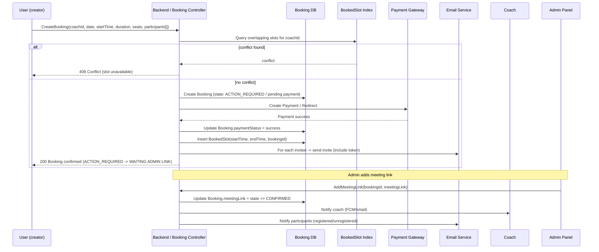
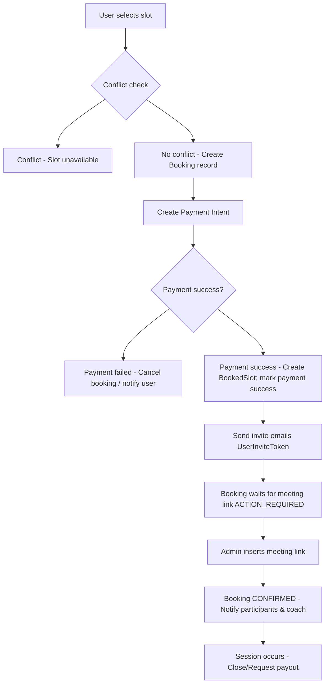

---

title: "Coach Booking — Architecture & Workflow"
description: "High-level overview, architecture, data models and flow diagrams for the Coach Booking module (user bookings, invites, validation/conflict checks, payments, meeting links and refunds)."
---

# Coach Booking — Overview & Architecture

This document describes the high-level architecture and working flow for the **Coach Booking** module used by:

* **Coach App (Coach)** — sets availability, sees bookings, can cancel or join sessions.
* **Website (User)** — discovers coaches, books sessions, invites participants (registered or unregistered).
* **Admin Panel (Admin)** — finalizes meeting links, manages refunds and other admin-only actions.

It focuses on the **end-to-end booking lifecycle**, the conflict-detection algorithm that prevents overlapping bookings, key data models, and integration points (payments, email, notifications).

---

## Goals

* Prevent double-booking by validating coach availability + existing sessions (public/live sessions and private bookings).
* Allow the booking creator to invite participants (registered or not) and manage attendees.
* Keep booking lifecycle explicit (draft/action-required/confirmed/cancelled/closed).
* Ensure strong auditability for payments and refunds — only admin-triggered refunds.
* Support safe, idempotent operations when seats or participants change.

---

## Actors

* **Coach** — provides availability, sees bookings, can cancel sessions.
* **Registered User** — books sessions, can invite others, can remove themselves or be removed.
* **Unregistered Invitee** — invited via an email link (token); can register and be attached to session.
* **Admin** — inserts meeting links, triggers refunds, approves cancellations as per policy.
* **Payments Provider** — (e.g., Razorpay) handles payments; refunds/payouts handled via admin flows.
* **Email service** — sends invites and confirmation emails.
* **Notification service** — push/FCM notifications for coaches and users.

---

## Components (high-level)

* **API Gateway / Backend** — receives requests, authenticates/authorizes, routes to controllers.
* **Booking Controller Service** — implements validation, conflict checks, invite tokens, participant management.
* **Availability Service** — stores coach weekly/daily availability slots.
* **Session/Booking DB** — stores booking documents (`Booking`), booked slots, and invite tokens.
* **Payments Service** — integrates with payment gateway and stores payment records.
* **Notification Service** — email and push notifications.
* **Admin Panel** — for meeting link insertion, refunds, booking state transitions.
* **Worker / Queue** — for background tasks (send invite emails, process refunds, notify participants).

---

## Primary Booking States

| State             | Description                                                      |
| ----------------- | ---------------------------------------------------------------- |
| `DRAFT`           | Booking created but incomplete (optional)                        |
| `ACTION_REQUIRED` | Booked & paid but admin has to add meeting link (or pre-confirm) |
| `CONFIRMED`       | Meeting link added — attendees can access the meeting            |
| `CANCELLED`       | Coach or admin cancelled the booking; refunds managed by admin   |
| `CLOSED`          | Session completed and payout/closeout completed                  |

---

## Key Data Models (summary)

> These are the primary fields used by the booking flows. Keep schemas normalized and indexed on `sessionId`, `coachId`, `date`, `startTime`, and `state` for fast queries.

### `Booking` (user booking / session)

* `bookingId` (string) — unique booking identifier
* `sessionId` (string) — session identifier (public or private)
* `coachId` (string) — coach reference
* `creatorUserId` (string) — user who created/paid for the booking
* `date` (ISO date) — session date
* `startTime` (ISO datetime) — session start timestamp (with timezone)
* `endTime` (ISO datetime) — computed end time (start + duration)
* `duration` (number) — minutes
* `seats` (number) — total seats purchased
* `participants` (array) — list of participant objects `{ userId?, email?, invited: boolean, inviteToken? }`
* `price`, `grandTotal`, `gstAmount` (numbers) — pricing and tax details
* `state` (enum) — `DRAFT|ACTION_REQUIRED|CONFIRMED|CANCELLED|CLOSED`
* `meetingLink` (string, optional) — populated by admin
* `refundStatus` (enum) — `none|requested|partial|completed|failed`
* `createdAt`, `updatedAt`

### `BookedSlot`

* `coachId`
* `sessionId`
* `startTime` (ISO datetime)
* `endTime` (ISO datetime)
* `bookingId`

> `BookedSlot` is used to check overlaps quickly and to mark/unmark slots when booking is completed or cancelled.

### `UserInviteToken`

* `token` (string, unique)
* `bookingId`
* `email`
* `expiresAt`
* `used` (boolean)
* `createdAt`

> Token is emailed to unregistered invitee. When they sign up with the same email and token exists and not used, the user is automatically added to the session.

### `Payment` / `UserPayment`

* `paymentId` (gateway id)
* `bookingId`
* `userId`
* `amount`, `currency`
* `status` — `pending|success|failed|refunded`
* `provider` — e.g. `razorpay`
* `createdAt`, `updatedAt`

---

## Conflict Detection Algorithm (how overlapping is prevented)

All times are normalized to UTC for comparison.

**Principle:** A new session **conflicts** with an existing booked slot if:

```
existing.startTime < newEndTime  AND  existing.endTime > newStartTime
```

**Implementation notes used by controllers:**

1. Convert `date + startTime` into a single UTC `Date` (`newStartTime`). Compute `newEndTime = newStartTime + duration`.
2. Query `BookedSlot` for `coachId` with an index on `startTime` and `endTime`:

```js
find({
  coachId,
  startTime: { $lt: newEndTime },
  endTime: { $gt: newStartTime }
})
```

3. If any record returned → conflict exists (reject booking).
4. Optionally apply small buffer (e.g., 5–10 minutes) before/after to allow cleanup or slight overlaps — if your controller enforces it, include it in the computed `newStartTime`/`newEndTime`.
5. Use transactions (or a lock) when writing `BookedSlot` and `Booking` so two simultaneous booking requests do not both pass the conflict check.

---

## Booking lifecycle — End-to-end (textual flow)

1. **Availability chosen:** User selects coach + date + time + seats from coach availability UI. Frontend sends a `create booking` request to backend.
2. **Conflict check:** Backend computes `start/end` and runs the conflict detection query against `BookedSlot` (and public sessions if applicable).
3. **Pre-authorize/Pay:** If seats and slot available, booking creation may create a `Payment` record and redirect to payment gateway (or perform immediate capture based on flow).
4. **Complete Payment:** On success, `payment.status` set to `success`. Booking `state` becomes `ACTION_REQUIRED` (waiting for meeting link or admin review).
5. **Invite participants:** For each invited email not tied to a registered user:

   * Create `UserInviteToken` (unique token, expiry).
   * Send email invite with tokenized link.
   * Mark participant as `invited: true` in `participants` list.
6. **Auto-attach on sign-up:** If an invited user signs up using the same email and token exists, the signup flow detects the token and attaches the user to `participants` and marks `used = true`.
7. **Admin adds meeting link:** Admin inserts `meetingLink` into booking; booking `state` transitions to `CONFIRMED`. Notifications sent to coach and participants.
8. **Session occurs:** Coach and participants attend. Admin/coach may mark attendance.
9. **Payout / Close:** After session, coach requests payment or admin processes payout. Booking `state` set to `CLOSED`.
10. **Cancellation & Refunds:** If session cancelled by coach, booking `state` becomes `CANCELLED`; admin reviews and initiates refunds (admin-only action). Refund records created and status updated.

---

## Sequence Diagram (Mermaid)



---

## Flowchart — Booking Creation & Confirmation



---

## Important Operational Details & Implementation Notes

### 1. Time normalization & timezone

* Save all booking times in UTC in DB. Persist the user's timezone if you need to render localized times. Conflict checks use UTC.

### 2. Atomic writes / race conditions

* Use DB transactions (MongoDB sessions) when:

  * creating `Booking` and `BookedSlot`, and
  * when marking a `UserInviteToken` as used and adding `participant` on sign-up.
* Alternatively, use optimistic locking (version field) or a short exclusive lock per `coachId` for booking windows.

### 3. Invite token lifecycle

* Token expiration (e.g., 72 hours) prevents stale invite links.
* `UserInviteToken` `used` flag prevents replay.
* During signup, the signup controller must check for tokens matching the signup email and attach user to booking.

### 4. Seats & dynamic pricing

* When extra participants are added, controllers should:

  * Recalculate `seats` and `grandTotal`; optionally require additional payment or disallow exceeding seats without re-payment.
  * If adding seats after initial payment, either create an incremental payment intent or mark as unpaid with a hold until payment clears.

### 5. Removing participants / revoking invites

* Any removal operation must:

  * Update `participants` list and `seats`
  * If seat count reduces, optionally issue partial refund (policy-defined) — refund only via admin
  * If an unregistered invite is revoked, mark invite token invalid and send notification

### 6. Cancellation & refunds

* Only admin can initiate refunds (safeguard). Refund workflow:

  * Admin triggers refund -> create `Refund` record -> call payment provider refund API -> update `refundStatus`
  * Optionally create a `refundQueue` for background retries if refund fails
* After refund completion, set `booking.state = CANCELLED` and unbook `BookedSlot`.

### 7. Meeting link insertion (admin)

* Meeting link is the gate that converts `ACTION_REQUIRED` → `CONFIRMED`. Until the meeting link is present, attendees should not get access to the meeting resource.

### 8. Notifications

* Key events that trigger notifications:

  * booking created / payment success
  * invites sent
  * invite accepted (auto-attach on signup)
  * admin adds meeting link
  * coach cancels session
  * admin refunds processed

---

## Indexes & Performance Tips

* Index `BookedSlot` on `{ coachId, startTime, endTime }` for quick conflict queries.
* Index `Booking` on `{ coachId, state, date }` for listing upcoming bookings.
* Index `UserInviteToken.token` and `UserInviteToken.email`.
* Consider TTL index on `UserInviteToken.expiresAt` for automatic cleanup.

---

## Security & Validation

* Validate requestor authenticity — booking and inviting require verified `genToken` / user session.
* For invite auto-attach: verify token + email match; do not allow hijacking by using different emails.
* Rate-limit booking attempts for same coach/time to prevent DOS / accidental double requests.
* Sanitize meeting links and any user-provided metadata.

---

## Deployment and Scaling Considerations

* Use a worker queue (e.g., RabbitMQ / SQS) for:

  * sending invite emails,
  * processing refunds or payment webhooks,
  * performing heavy reconciliation tasks.
* For high traffic booking windows, use a short lock-per-coach strategy (distributed lock like Redis Redlock) for conflict-critical writes.
* Use monitoring/alerts for refund failures and payment gateway errors.

---

## Quick Reference - Booking States & Triggers

|                      Transition | Trigger                                |
| ------------------------------: | -------------------------------------- |
|     `DRAFT` → `ACTION_REQUIRED` | Payment success                        |
| `ACTION_REQUIRED` → `CONFIRMED` | Admin adds meeting link                |
|               Any → `CANCELLED` | Coach/admin cancels (refund by admin)  |
|          `CONFIRMED` → `CLOSED` | Session completed and payout processed |

---

## Appendix — Example JSON (Booking creation request)

```json
{
  "coachId": "COH00012",
  "date": "2026-02-20",
  "startTime": "2026-02-20T09:00:00Z",
  "duration": 60,
  "seats": 3,
  "participants": [
    { "userId": "USR0001" },
    { "email": "guest1@example.com" },
    { "email": "guest2@example.com" }
  ],
  "payment": {
    "method": "razorpay",
    "amount": 500
  }
}
```

---

## Summary & Recommendations

* Enforce UTC-based times and consistent timezone handling on the UI.
* Use `BookedSlot` index to centralize conflict detection and keep it as the canonical source for scheduled time ranges.
* Make invite tokens short-lived and single-use to avoid stale or malicious attachments.
* Keep refunds and payouts strictly admin-controlled and processed via background workers for reliability.
* Protect critical writes with transactions or distributed locks to prevent race conditions.

---
