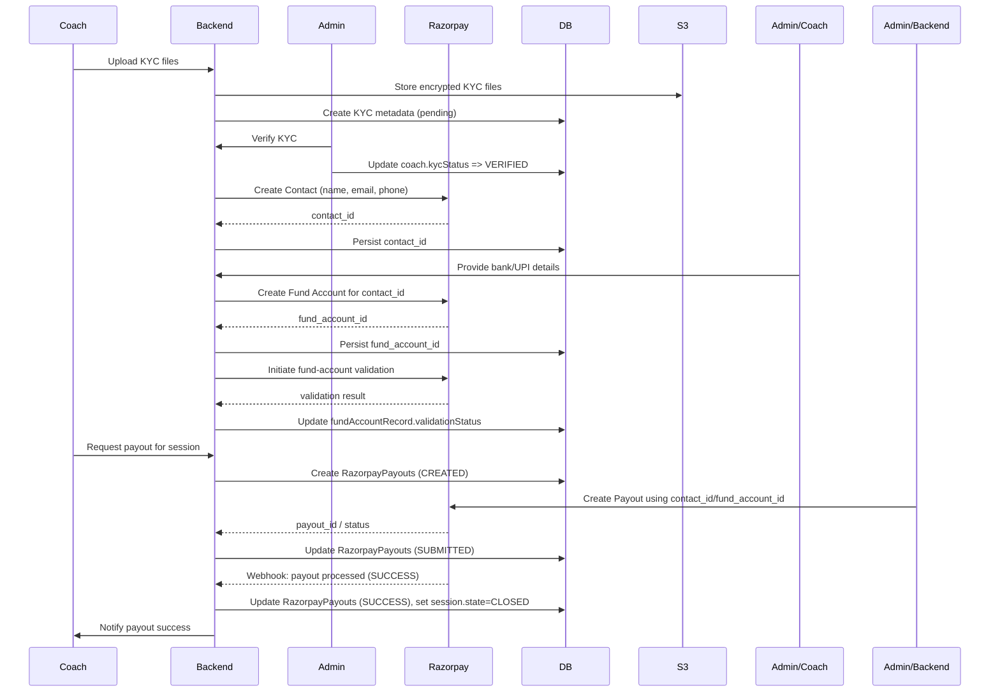

# Coach Payment — Workflow Overview & Architecture

This document describes the full end-to-end workflow and architecture for coach payments on the Fitnearn platform. It covers how coaches are prepared to receive payments, how contacts and fund-accounts are created and validated with Razorpay, how automated payouts and manual payouts are handled, and the operational, security and reconciliation considerations you should build into the system.

This is an architecture/flow document — it intentionally avoids route-level API details and focuses on processes, data, failure modes, and design decisions.

---

## Quick summary 

Coaches who are KYC-verified are added as Razorpay Contacts, a bank/UPI Fund Account is created and validated for each contact, and payouts (automated or manual) are issued against that fund account; once a payout is completed for a session, the session state is closed and accounting/audit records are generated.

---

## Actors & systems

* **Coach (Coach App)** — creates sessions and requests payouts.
* **Registered User (Website)** — can book coaches (leads to session payments, coach fees).
* **Admin (Admin Panel)** — verifies KYC, attaches bank details, approves manual payouts and initiates automated payouts.
* **Fitnearn Backend** — orchestrates flows, persists records, calls Razorpay, stores proofs in S3, sends notifications.
* **Razorpay** — external payments provider (Contacts, Fund Accounts, Payouts).
* **S3 (or encrypted storage)** — stores proof-of-payment images and encrypted KYC artifacts.
* **Database** — stores CoachProfile, Session, RazorpayPayouts, FundAccountRecord, AuditLog, etc.
* **Notification Service** — push / email notifications to coach and admin.

---

## Preconditions (what must be true before payouts)

* **Coach account verified** — admin must have verified the coach account and KYC docs (PAN/ID). `coach.kycStatus === 'VERIFIED'` or equivalent.
* **Contact & Fund Account present** — coach must have a Razorpay `contact_id` and `fund_account_id` stored on their profile.
* **Fund Account validated** — fund-account verification completed (Razorpay or local verification), or admin has marked account `VERIFIED` via admin override.
* **Session completed** — the session for which a payout is requested should have a `COMPLETED` state and be eligible for payout (no outstanding disputes/refunds).

---

## Key entities (logical)

Below are the primary entities involved in the coach payment workflow and the important fields you should keep in your DB model. (These are logical fields used in the architecture — implementation names may vary.)

### CoachProfile (partial)

* `coachId` — internal coach id (COH0001)
* `name`, `email`, `phone`
* `kycStatus` — UNVERIFIED | PENDING | VERIFIED | REJECTED
* `razorpayContactId` — Razorpay contact_id
* `razorpayFundAccountId` — Razorpay fund_account_id (could be multiple; store array if supporting many)
* `fundAccountStatus` — UNVERIFIED | IN_PROGRESS | VERIFIED | BLOCKED
* `contactId` — razorpay contact id
* `fundAccountId` — razorpay fund account id

### CoachAgreementModel (partial)

* `coachId` — internal coach id (COH0001)
* `bookingPrice` — Price Per coach booking (from agreement)
* `liveSessionPrice` — Price Per Live Session (from agreement)

### Session (partial)

* `sessionId`
* `coachId`
* `type` — PUBLIC | PRIVATE
* `state` — APPROVED | REJECTED | COMPLETED | PAYMENT_REQUESTED | CLOSED | CANCELLED

### RazorpayPayouts (PayoutRecord)

* `payoutId` — internal id (e.g., POUT0001)
* `sessionId` (optional)
* `coachId`
* `amount` (integer; in Rupees/ standard unit)
* `currency`
* `method` — RAZORPAY_PAYOUT | MANUAL
* `razorpayPayoutId` — id returned by Razorpay (if used)
* `status` — CREATED | SUBMITTED | PROCESSING | SUCCESS | FAILED | REVERSED
* `requestedAt`, `processedAt`, `completedAt`
* `proofUrl` — S3 url for proof image (manual payouts)
* `notes`, `adminId` (who processed), `failureReason`
* `idempotencyKey` — to ensure safe retries

### CoachKYC (partial)

* `recordId`
* `coachId`
* `type` — BANK_ACCOUNT | UPI
* `details` — masked account number / IFSC / upiId
* `validationStatus` — IN_PROGRESS | VERIFIED | FAILED

---

## High-level flow (sequence)

Below is the canonical sequence from onboarding → payout. A mermaid-style flow is included afterwards.

1. **Coach Onboards & Uploads KYC**
   * Coach submits KYC documents via the app; backend uploads KYC files to encrypted S3 and stores KYC metadata.
2. **Admin KYC Verification**
   * Admin reviews documents; if approved, `coach.kycStatus → VERIFIED`.
3. **Create Razorpay Contact**
   * Backend creates a Razorpay Contact using coach name/email/phone and persists `contact_id`.
4. **Attach/ Create Fund Account**
   * Backend creates a Fund Account (bank account or UPI) under that contact and persists `fund_account_id`.
5. **Validate Fund Account**
   * Call Razorpay fund-account validation API (or do micro-deposit/UPI validation flow).
   * Mark `profile.kycVerified` accordingly.
6. **Coach Requests Payout**
   * After session completion, coach requests payout (or system auto-creates payout request based on earnings).
   * `RazorpayPayouts` created with session status: `PAYMENT REQUESTED`, `idempotencyKey` assigned.
7. **Admin/Auto Initiates Payout**
   * Preconditions validated (fund account `VERIFIED`, no disputes). `sendPayout` is invoked.
   * Use Razorpay Payout API with `contact_id`, `fund_account_id`, `amount`, `mode`.
   * Update `RazorpayPayouts` with `razorpayPayoutId` and status: `Payment successful`.
8. **Razorpay Processing / Webhook / Polling** (Additional Future Integration)
   * Use Razorpay webhooks or status polling to set `RazorpayPayouts.status` to `PROCESSING → SUCCESS | FAILED`.
   * On success, set `session.state = CLOSED`, `paymentStatus = PAID`.
9. **Manual Payout (alternative)**
   * Admin can record an off-razorpay payment via `manualPayout`: save proof image to S3 and create `RazorpayPayouts` with method: `MANUAL` and status: `SUCCESS` (or `RECONCILED` after admin confirms).
   * After manual payout, update session and records accordingly.
10. **Reconciliation & Reporting**
   * Finance reconciles payouts (Razorpay statements vs internal records).
   * Generate reports, update balance ledgers.

---

## Mermaid sequence (visual)

---

## Idempotency & Safety patterns

* **Idempotency Key**: Every payout attempt must have an `idempotencyKey` generated and saved. Repeated requests with same key must not create duplicate Razorpay payouts.
* **Status checks before retry**: On errors, check `RazorpayPayouts.status` and `razorpayPayoutId` before retrying.
* **Pre-checks**: Before calling payout, assert `ProfileModel.kycStatus === VERIFIED`.

---

## Failure modes & retry strategy

* **Razorpay transient errors** (5xx or network)
  * Retry with exponential backoff (3–5 retries). Maintain idempotency.
* **Payout failed** (insufficient funds / account rejected)
  * Mark `RazorpayPayouts.failureReason`. Notify admin + coach. Offer manual payout option.
* **Fund-account validation failed**
  * Set `fundAccountRecord.validationStatus = FAILED`. Notify coach to update bank details.
* **Webhook missed / delayed**
  * Poll Razorpay payout status periodically for `SUBMITTED` payouts (fallback).
* **S3 upload failure for proof image**
  * Abort manual payout creation — bubble up error to admin UI and retry.

---

## Security & compliance

* **KYC storage**: KYC documents are sensitive; store encrypted in a dedicated S3 bucket with server-side encryption and restricted access. Consider envelope encryption (KMS) or client-side encryption.
* **Access controls**: Only admin users with proper permissions can initiate payouts and change fund-account status.
* **Least privilege for secrets**: Razorpay keys must be stored in secure environment (secrets manager).
* **Audit trail**: Every change (create contact, attach fund account, initiate payout, manual payout) must create an `AuditLog` entry with actor, timestamp, and metadata.
* **Data masking**: Do not store full account numbers in plaintext. Persist only masked representations and store proofs securely.
* **Compliance & record retention**: Keep payout and KYC records to meet regional financial compliance / taxation obligations.

---

## Notifications & UX expectations

* **Coach notifications**: When payout is requested, when payout is processed, and if payout failed.
* **Admin notifications**: When fund account validation fails, when payout requires manual intervention, and daily summary of pending payout requests.
* **UI states**: Expose clearly in coach app: Payout Requested, Payout Processing, Payout Completed, Payout Failed (reason).

---

## Reconciliation & reporting

* **Daily batch reconciliation**: Compare Razorpay settlement / payout reports with internal `RazorpayPayouts` records.
* **Ledgering**: Maintain a payments ledger per coach to track gross, fees, taxes, net payouts, and outstanding balances.
* **Discrepancies**: Flag mismatches for manual audit and support resolution.

---

## Webhooks & async events

* **Use Razorpay webhooks**: Listen for payout events (processing, success, failure). Validate webhook signatures.
* **Webhook handling**: Update `RazorpayPayouts` status and post notifications. Log raw webhook payloads (securely) for troubleshooting.
* **Fallback polling**: If webhooks fail, periodically poll Razorpay for status of pending payouts.

---

## Manual payouts (operational flow)

Admin records an off-platform payment using `manualPayout`:

* Upload proof image (S3) and create a `RazorpayPayouts` with `method = MANUAL`.
* Attach proof metadata, admin remarks, and session reference.
* Mark `RazorpayPayouts.status = SUCCESS` (or `RECONCILED`) after admin verifies the proof.
* Update `session.state = CLOSED`, `paymentStatus = PAID`.

Manual payouts are useful for reimbursements, offline settlements, or bank transfers not routed via Razorpay.

---

## Observability & metrics

Track the following metrics for health and operations:

* Payouts per day / week
* Payout success rate
* Average time from request → settlement
* Fund-account validation success rate
* Manual payouts vs automated
* Number of idempotent-retries and transient failures
* Time to reconcile mismatches

---

## Testing & environments

* **Razorpay sandbox** — Test contact/fund-account/payout flows on sandbox credentials before production.
* **Dry-run mode** — Consider a "dry-run" option where payout payload is validated but not submitted.
* **E2E reconciliation tests** — Simulate sessions → payout requests → Razorpay responses and verify DB state transitions.

---

## References (Razorpay official docs)

* [Razorpay Contacts](https://razorpay.com/docs/api/x/contacts)
* [Razorpay Fund Accounts](https://razorpay.com/docs/api/x/fund-accounts)
* [Razorpay Payouts](https://razorpay.com/docs/api/x/payout-composite)