# Access Control System Architecture

## 1. Overview

The FitEarn Access Control System is a sophisticated, multi-layered framework designed to provide granular control over what actions an admin user can perform. It builds upon the principles of Role-Based Access Control (RBAC) and enhances it with flexible concepts like Groups and restrictive Permission Boundaries.

The core philosophy is to centralize access logic, making it maintainable, scalable, and secure. Every protected action is governed by a unique `Action Key`, and access is granted or denied based on a combination of the user's assigned Roles, Groups, direct permissions, and explicit restrictions.

### Key Components:
- **Foundational Elements**: Modules, Action Keys, and Permissions form the bedrock of what can be controlled.
- **Assignment Entities**: Roles and Groups are used to bundle permissions and assign them to users efficiently.
- **The Subject**: The Admin User is the entity to whom access is granted.
- **The Gatekeeper**: A series of middlewares (`` `authenticateAdminToken` ``, `` `authorize` ``) that enforce the rules on every incoming request.

## 2. Core Components & Relationships

The system's components are hierarchically related. Understanding this structure is key to managing access effectively.

```mermaid
graph TD
    subgraph "Core Entities"
        AdminUser["👤 Admin User"]
        Group["👥 Group"]
        Role["🏷️ Role"]
    end

    subgraph "Permission Definitions"
        Permission["📄 Permission"]
        PermissionBoundary["🚫 Permission Boundary"]
        ActionKey["🔑 Action Key"]
        Module["🗂️ Module"]
    end

    AdminUser -->|Belongs to| Group
    AdminUser -->|Is Assigned| Role
    AdminUser -->|Has Direct| Permission
    AdminUser -->|Is Restricted by| PermissionBoundary

    Group -->|Contains| AdminUser
    Group -->|Includes| Role
    Group -->|Grants| Permission

    Role -->|Contains| Permission

    Permission -->|Uses| ActionKey
    Permission -->|Is part of| Module

    %% Darker, high-contrast styles for better visibility on dark themes
    style AdminUser fill:#337ab7,stroke:#5bc0de,stroke-width:2px,color:#ffffff
    style Group fill:#c69a21,stroke:#f0ad4e,stroke-width:2px,color:#ffffff
    style Role fill:#8253a8,stroke:#b393d3,stroke-width:2px,color:#ffffff
```

---

### 2.1. Foundational Elements

These are the raw materials used to define controllable actions in the system.

<Card title="🗂️ Module" icon="folder-open">
  **Purpose**: A high-level container for grouping related permissions (e.g., "User Management", "Media Management").
  **Function**: Provides organizational structure and helps in filtering and managing permissions in the admin UI.
</Card>

<Card title="🔑 Action Key" icon="key">
  **Purpose**: A unique, hardcoded string that represents a specific action in the backend code (e.g., `` `USER_CREATE` ``, `` `ACCESS_PERMISSION_EDIT` ``).
  **Function**: It's the "key" that the `` `authorize()` `` middleware checks for. This decouples the human-readable permission name from the code logic, allowing you to change display names without breaking the authorization flow.
</Card>

<Card title="📄 Permission" icon="file-check">
  **Purpose**: The central component that links an `Action Key` to a `Module`.
  **Function**: It represents a single, grantable right. A permission essentially says: "The action identified by an `` `ACTION_KEY` `` within a `` `MODULE` `` is a valid permission that can be assigned."
</Card>

---

### 2.2. Assignment Entities

These entities are used to assign collections of permissions to users.

<Card title="🏷️ Role" icon="tag">
  **Purpose**: A collection of permissions that define a specific job function (e.g., "Editor", "Approver", "Viewer").
  **Function**: Simplifies permission management. Instead of assigning dozens of individual permissions to a user, you assign a single Role. A user can have multiple Roles.
</Card>

<Card title="👥 Group" icon="users">
  **Purpose**: A versatile container for managing teams or departments.
  **Function**: A Group is more powerful than a Role. It can contain:
  - A list of **Admin Users** (members).
  - A set of **Roles**.
  - A collection of its own direct **Permissions**.
  This allows for complex access setups where a user inherits permissions from their direct assignments, their Roles, *and* all the Groups they belong to.
</Card>

---

### 2.3. The Subject and The Restriction

<Card title="👤 Admin User" icon="user-shield">
  **Purpose**: The end-user of the admin panel whose access needs to be controlled.
  **Function**: An Admin User object aggregates all access control elements. It can be directly assigned:
  - Multiple **Roles**.
  - Multiple **Groups**.
  - Specific **Permissions**.
  - A **Permission Boundary**.
</Card>

<Card title="🚫 Permission Boundary" icon="ban">
  **Purpose**: An advanced security feature that explicitly **denies** permissions.
  **Function**: A Permission Boundary is a list of permissions that a user is **never** allowed to exercise, regardless of what their Roles or Groups might grant them. It acts as a final, restrictive filter. **A boundary always wins.**
</Card>

## 3. The Authorization Flow: A Deep Dive into the Middleware

Every protected API request is guarded by a sequence of middlewares that act as a sophisticated gatekeeper. This process is divided into two fundamental questions: **"Who are you?" (Authentication)** and **"What are you allowed to do?" (Authorization)**. Understanding this flow is critical to comprehending how security is enforced.

### The Decision-Making Process at a Glance

The following flowchart illustrates the entire decision tree, from the moment a request arrives until access is either granted or denied.

---

### Step 1: Authentication (`authenticateAdminToken`) - Verifying Identity

Before the system can decide *what* a user can do, it must first confirm *who* they are. This middleware handles identity verification.

1.  **Token Extraction**: It looks for a JSON Web Token (JWT) in the `gentoken` HTTP header of the incoming request. If no token is found, the request is immediately rejected.
2.  **Token and Session Validation**:
    *   It verifies the JWT's signature and expiration using the application's secret key.
    *   Crucially, it also queries the `AdminSessionModel` in the database to ensure the session associated with this token is still active. This step is vital for enabling a "logout everywhere" feature, as simply having a valid JWT is not enough if the session has been terminated.
3.  **User Hydration**: Upon successful validation, it uses the `adminId` from the token to fetch the complete `adminUser` document from MongoDB.
4.  **Attaching the User to the Request**: The fetched user object, rich with its roles, groups, and permissions, is attached to the Express `request` object (as `req.adminUser`). This "hydrated" request object is then passed to the next middleware in the chain.

If any of these checks fail, the process stops, and a `401 Unauthorized` response is sent.

### Step 2: Authorization (`authorize(requiredActionKey)`) - Checking Permissions

With a verified user attached to the request, this middleware executes a precise, ordered set of rules to determine if the user has the right to perform the requested action. The logic prioritizes denial and efficiency.

<Card title="Rule 1: The 'Deny First' Principle (Permission Boundary)" icon="ban">
**This is the most important rule and is always checked first.** The system inspects the user's `permissionBoundary` list. If the `requiredActionKey` for the requested endpoint is found in this list, access is **immediately denied with a `403 Forbidden` error**. This acts as an absolute override, ensuring that no matter what permissions are granted through roles or groups, a boundary can explicitly forbid an action.
</Card>

<Card title="Rule 2: The 'Fast-Track Exits' (Self-Access & SUPERADMIN)" icon="fast-forward">
If the action is not denied by a boundary, the system looks for shortcuts to grant access efficiently.
-   **Self-Access**: If a route is configured with `{ allowSelfAccess: true }` (like viewing one's own user profile), and the user is indeed accessing their own resource, the check succeeds, and the request proceeds.
-   **SUPERADMIN**: If the user has the `` `SUPERADMIN` `` role, they are granted access to any action not explicitly denied by a permission boundary. This bypasses all further checks.
</Card>

<Card title="Rule 3: The Permission Aggregation Engine" icon="gears">
If the user is not a `SUPERADMIN`, the system must determine their effective permissions by collecting them from all possible sources. It creates a master set of all `` `permissionId` ``s the user has access to from:
1.  **Directly Assigned Permissions**: Permissions attached directly to the user's own document.
2.  **Role-Based Permissions**: All permissions granted by all `Roles` assigned to the user.
3.  **Group-Based Permissions**: All permissions granted by all `Groups` the user is a member of. This is recursive; it includes permissions attached directly to the group *and* permissions from any roles embedded within those groups.
</Card>

<Card title="Rule 4: The 'Special Role' Override (ACCESSMANAGER)" icon="user-shield">
The `` `ACCESSMANAGER` `` role has unique, hardcoded privileges. This role is automatically granted permission to perform any action within the "User Management" (`` `MODULE-1` ``) and "Access Management" (`` `MODULE-3` ``) modules, as long as the action isn't blocked by their permission boundary. This allows them to manage users and their access without needing every single permission explicitly assigned.
</Card>

<Card title="Rule 5: The 'Logical Prerequisite' Check" icon="list-check">
For security and logical consistency, the system enforces a hierarchy. Before a user can perform an action with a suffix like `` `_CREATE` ``, `` `_EDIT` ``, or `` `_DELETE` ``, they must first have the corresponding "view" permission.
- **Example**: To be granted access for the `` `USER_EDIT` `` action key, the middleware first checks if the user's aggregated permissions also include the `` `USER_VIEW` `` key. If they cannot view users, they are not permitted to edit them, and the request is denied.
</Card>

<Card title="Rule 6: The Final Verdict" icon="gavel">
After all the previous checks, the system performs its final check: It looks for the `requiredActionKey` within the master set of aggregated permissions.
-   If a matching permission is found, the `authorize` middleware calls `` `next()` ``, passing control to the final destination: the API controller function.
-   If no matching permission is found, the user does not have the required rights, and the middleware returns a `403 Forbidden` response with a detailed error message.
</Card>

## 4. API Endpoint Groups

The access management system is controlled via the following groups of API endpoints:

| Group | Purpose | Example Endpoint |
| :--- | :--- | :--- |
| **Module Management** | Create and list organizational modules. | `` `POST /access/modules/add` `` |
| **Action Key Management** | Create and list the code-level action identifiers. | `` `POST /access/permissions/add-actionKey` `` |
| **Permission Management** | Create, read, update, and delete permissions. | `` `POST /access/permissions/add` `` |
| **Role Management** | Manage roles and assign permissions to them. | `` `POST /access/roles/create` `` |
| **Group Management** | Manage groups, their members, roles, and permissions. | `` `POST /access/group/create` `` |
| **Admin User Management** | Create and manage admin users and their assignments. | `` `POST /access/users/add` `` |
| **Password Management** | Handle password changes and resets. | `` `POST /access/users/reset-password` `` |
