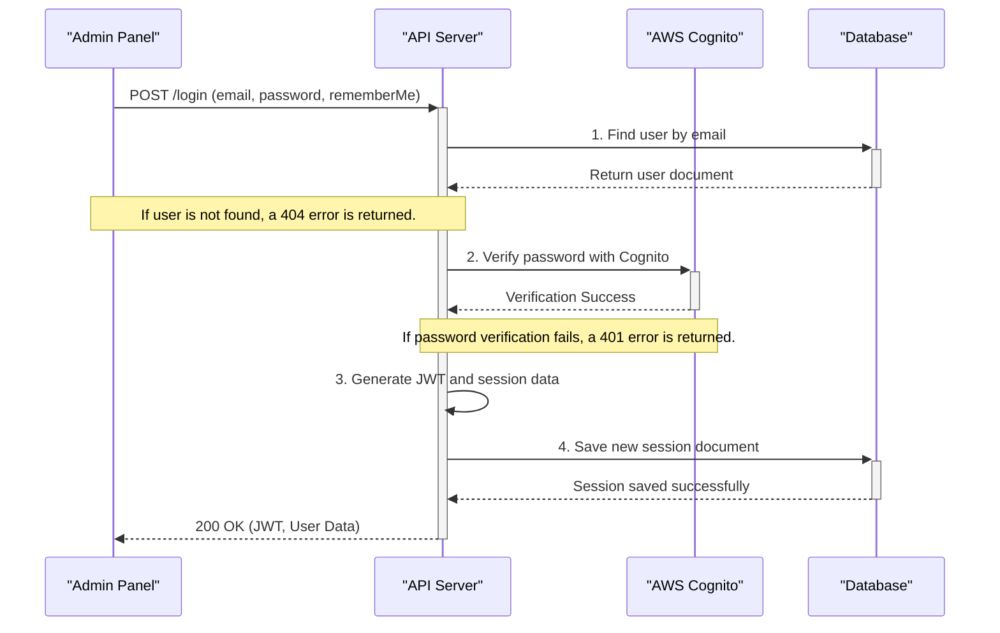

# Admin Authentication & Session Management Architecture

## 1. Overview

The Admin Authentication system provides secure, stateful, and persistent login capabilities for the FitEarn admin panel. It is engineered to be robust by delegating primary password verification to **AWS Cognito**, while managing session state and application-specific logic within our own backend.

This architecture ensures a clear separation of concerns, enhances security by leveraging a managed identity provider, and provides a flexible session management system that supports both standard and long-lived ("Remember Me") sessions.

### Key Goals & Technologies:
- **Secure Authentication**: Uses AWS Cognito for password validation, preventing the need to handle raw passwords directly for verification.
- **Stateful Sessions**: Employs a database-backed session model (`` `AdminSessionModel` `` in MongoDB) to track active logins, enabling features like server-side logout.
- **Persistent Logins**: Supports a "Remember Me" feature for extended session durations.
- **Stateless Authorization**: Uses JSON Web Tokens (JWTs) as temporary "keycards" for authorizing subsequent API requests.
- **Robust Validation**: Implements a session validation endpoint that can automatically refresh expired tokens for "Remember Me" sessions, providing a seamless user experience.

---

## 2. Core Components

The system is a collaboration between several key components, each with a distinct role.

<Card title="🔐 AWS Cognito" icon="aws">
  **Purpose**: The primary Identity Provider (IdP).
  **Function**: It securely stores user identities and is the single source of truth for password verification. Our backend never compares passwords directly; it asks Cognito, "Is the password for this email correct?" This offloads a major security responsibility.
</Card>

<Card title="🔑 JSON Web Token (JWT)" icon="key">
  **Purpose**: A stateless, self-contained "keycard" for API access.
  **Function**: After a successful login, the backend generates a signed JWT containing the admin's ID, email, and role. This token is sent to the frontend and included in the header of every subsequent API request to prove the user's identity without hitting the database every time. It has a short expiry (e.g., 1 day).
</Card>

<Card title="📓 AdminSessionModel (MongoDB)" icon="book">
  **Purpose**: The stateful session logbook.
  **Function**: For every successful login, a document is created in this collection. It stores the user's ID, the active JWT, device information, and whether "Remember Me" is enabled. It has a longer TTL (Time-To-Live) index, especially for "Remember Me" sessions (e.g., 7 days), allowing the system to track and manage active sessions independently of the JWT's short lifespan.
</Card>

<Card title="🚫 AdminRevokedToken (MongoDB)" icon="ban">
  **Purpose**: A blacklist for stolen or logged-out tokens.
  **Function**: When a user logs out, their JWT is added to this collection. The `` `checkSessionJWTValidity` `` endpoint checks against this list to ensure a token that hasn't expired yet cannot be reused, providing a robust server-side logout mechanism.
</Card>

---

## 3. The Authentication & Session Creation Flow (Login)

This sequence diagram illustrates the step-by-step process when an admin logs in.



### Breakdown of the Login Process:

<Steps>
### Step 1: User Submits Credentials
The user provides their email, password, and optionally checks the "Remember Me" box.

### Step 2: Initial User Lookup
The backend receives the request and first queries its own `` `UserModel` `` in MongoDB to ensure an admin account with that email exists in the system. If not found, a `404 Not Found` error is returned.

### Step 3: Password Verification via Cognito
This is the most critical security step. The backend does **not** compare the password itself. Instead, it calls the `` `verifyCognitoPassword` `` helper, which sends an `` `InitiateAuthCommand` `` to AWS Cognito. If this fails, a `401 Unauthorized` error is returned.

### Step 4: JWT Generation & Session Creation
Upon successful verification, the backend's `` `generateTokenAndSetSession` `` function is triggered:
-   A **JWT** is created with a standard, short expiry (e.g., 24 hours).
-   A new document is created in the **`` `AdminSessionModel` ``**. This document's `` `expiresAt` `` field is set conditionally:
    -   If `` `rememberMe` `` is `false`: Expires in 24 hours.
    -   If `` `rememberMe` `` is `true`: Expires in a longer period, like 7 days, as defined by environment variables.

### Step 5: First Login Logic
The system checks if `` `adminUser.isFirstLogin` `` is true. If so, it sends a welcome notification and updates the flag to `false`. For all logins, it updates the `` `lastLogin` `` timestamp.

### Step 6: Response to Frontend
The backend returns a `200 OK` response containing the newly generated JWT (as `genToken`) and user data, allowing the frontend to store the token and navigate to the dashboard.
</Steps>

---

## 4. Session Validation & Auto-Refresh Flow

The `` `GET /check-session-validity` `` endpoint is a powerful mechanism for maintaining a seamless user experience, especially for "Remember Me" sessions.

### Key Logic within `checkSessionJWTValidity`:

<Card title="1. Initial Session & Token Checks" icon="shield-check">
It first checks if the provided token exists in the `` `AdminSessionModel` `` and is not on the `` `AdminRevokedToken` `` blacklist. If either check fails, the session is invalid.
</Card>

<Card title="2. Special Case: Password Reset" icon="key">
It checks if the user's password field in the database is empty. This indicates their password was reset by a superadmin. If so, it returns a special response prompting the user to use their one-time reset link, effectively blocking them from normal access until they set a new password.
</Card>

<Card title="3. JWT Expiration Handling & Auto-Refresh" icon="sync-alt">
This is the core of the "Remember Me" feature.
-   The middleware uses a `` `try...catch` `` block to verify the JWT.
-   **If the token is valid and not expired**, it returns a success message.
-   **If the token is expired** (due to a `` `TokenExpiredError` ``):
    -   It checks the `` `rememberMe` `` flag on the corresponding `` `AdminSessionModel` `` document.
    -   If `` `rememberMe` `` is `false`, the session is over. The document is deleted, and a `401 Unauthorized` response is sent.
    -   If `` `rememberMe` `` is `true`, the system **generates a new JWT** with a fresh 24-hour expiry. It updates the `` `AdminSessionModel` `` with this new token and returns it to the frontend. The frontend can then silently replace its old token with the new one, keeping the user logged in without interruption.
</Card>

## 5. Logout Flow

The logout process ensures that a session is securely and completely terminated on the server side.

1.  **Receive Token**: The frontend sends the JWT of the user logging out to `` `POST /admin/auth/logout` ``.
2.  **Revoke Token**: The backend adds the received JWT to the `` `AdminRevokedToken` `` collection. This collection has a TTL index, so old revoked tokens are automatically purged.
3.  **Delete Session**: The backend finds and deletes the corresponding session document from the `` `AdminSessionModel` ``.

This two-step process guarantees that even if an attacker gets a copy of the JWT before it expires, it will be rejected by the validation middleware because it's on the revoked list and its session no longer exists.

## 6. API Endpoints

| Method | Endpoint | Description |
| :--- | :--- | :--- |
| `POST` | `` `/api/fitnearn/web/admin/auth/login` `` | Authenticates a user with Cognito, creates a session, and returns a JWT. |
| `POST` | `` `/api/fitnearn/web/admin/auth/logout` `` | Invalidates the user's current session and revokes their JWT. |
| `GET` | `` `/api/fitnearn/web/admin/auth/check-session-validity` `` | Checks if a JWT is valid and, if applicable, refreshes it. |
```