# Subscription Management System Architecture

## 1. Overview

The FitEarn Subscription Management System provides a comprehensive suite of tools for administrators to define, manage, and analyze subscription offerings. This system is the backbone of the platform's monetization strategy, allowing for flexible creation of both FREE and PAID plans, tracking user subscriptions, and generating critical business analytics.

The architecture is built on a modular, service-oriented approach within the Express.js framework. It leverages a robust middleware chain for security and data processing, and it interacts with a MongoDB database through Mongoose models for data persistence.

### Key Functional Areas:
- **Plan Management (CRUD)**: Administrators can create, view, update, and delete subscription plans.
- **User Subscription Analytics**: The system provides detailed views of which users are subscribed to which plans.
- **Aggregate Analytics**: Efficient, high-level counting of subscriptions by type and status for dashboard reporting.
- **Secure by Design**: Every action is protected by a multi-layered access control system, ensuring that only authorized administrators can perform sensitive operations.

## 2. Core Components & Data Models

The system is composed of several interconnected data models that represent the lifecycle of a subscription.

### Entity-Relationship Diagram

This diagram illustrates the relationships between the primary data models: `AdminUser`, `SubscriptionPlan`, `User`, and `UserSubscription`.

---

### 2.1. Core Data Models

<Card title="📋 Subscription Plan" icon="file-alt">
  **Purpose**: Defines a template for a subscription that users can purchase. It contains all pricing, features, and metadata.
  **Key Fields**:
  - `` `SUBS_ID` ``: Unique, system-generated string ID.
  - `` `plan_id` ``: Auto-incrementing integer ID.
  - `` `plan_name` ``, `` `planType` `` ('FREE'/'PAID'), `` `status` `` ('Active'/'Inactive').
  - `` `price` ``, `` `period` `` ('monthly'/'yearly'), `` `discountPercent` ``.
  - `` `features` ``: A flexible `Map` object to store key-value pairs of plan features (e.g., `{"video_quality": "HD", "device_limit": 3}`).
  - `` `effectivePrice` ``: Calculated price after discounts.
</Card>

<Card title="🔗 User Subscription" icon="link">
  **Purpose**: An instance of a `User` subscribing to a `SubscriptionPlan`. This is the central record for tracking an individual user's subscription history, status, and payment details.
  **Key Fields**:
  - `` `USR_SUB_ID` ``: Unique ID for this specific subscription instance.
  - `` `userId` `` (Ref to `User`): The user who subscribed.
  - `` `subscriptionPlan` `` (Ref to `SubscriptionPlan`): The plan they subscribed to.
  - `` `status` `` ('Active', 'Cancelled', 'Deactivated').
  - `` `startDate` ``, `` `renewalDate` ``.
  - `` `paymentId` ``, `` `orderId` ``, `` `payment_mode` ``.
  - `` `upgradedFrom` ``, `` `previousRepeatedPlan` `` (Self-Ref): Links to a previous subscription record for tracking user journey.
</Card>

## 3. Architectural Flow & Endpoint Analysis

The system exposes a set of RESTful API endpoints, each protected by a chain of middleware before the controller logic is executed.

### The Middleware Chain: A Consistent Guardian

Every protected route follows a standard, three-stage pipeline before reaching the main controller logic.

```mermaid
graph LR
    subgraph "Request Pipeline"
        Request["Incoming API Request"] --> M1["1. authenticateAdminToken"];
        M1 -->|"✅ Valid Session"| M2["2. authorize(ACTION_KEY)"];
        M2 -->|"✅ Permission Granted"| M3["3. idGenerationMiddleware (on create)"];
        M3 -->|"✅ ID Generated"| Controller["🎯 Controller Logic"];
        Controller --> Response["HTTP Response"];
    end

    subgraph "Failure Paths"
        M1 -->|"❌ Invalid Token"| Deny401["Denied (401)"];
        M2 -->|"❌ No Permission"| Deny403["Denied (403)"];
    end

    style Controller fill:#286c34,stroke:#34c759,stroke-width:2px,color:#ffffff;
    style Deny401,Deny403 fill:#a4262c,stroke:#ff453a,stroke-width:2px,color:#ffffff;
```

1.  **`authenticateAdminToken`**: Verifies the admin's JWT and active session. Answers "Who are you?".
2.  **`authorize(ACTION_KEY)`**: Checks if the authenticated admin has the specific permission (e.g., `SUBSCRIPTION_PLAN_CREATE`) required for the endpoint. Answers "What are you allowed to do?".
3.  **`idGenerationMiddleware`**: (Used on creation) Generates a unique, prefixed ID (`SUBS-xxxxx`) to ensure consistency and prevent collisions.

---

### Endpoint Breakdown

<Card title="POST /api/.../subscription-plan/create" icon="plus-circle">
  **Purpose**: Create a new subscription plan.
  **Flow**:
  1.  The middleware chain authenticates the admin, authorizes `SUBSCRIPTION_PLAN_CREATE`, and generates a `SUBS_ID`.
  2.  `createSubscriptionController` validates the request body for required fields (`plan_name`, `planType`, `price`, etc.).
  3.  It programmatically determines the next integer `plan_id` by finding the highest existing one.
  4.  It calculates the `effectivePrice` based on the base price and discount.
  5.  A new `SubscriptionPlan` document is created and saved to the database.
  6.  A `201 Created` response is returned with the new plan object.
</Card>

<Card title="PUT /api/.../subscription-plan/edit/:planId" icon="edit">
  **Purpose**: Update an existing subscription plan.
  **Flow**:
  1.  The middleware chain authenticates and authorizes `SUBSCRIPTION_PLAN_EDIT`.
  2.  `updateSubscriptionPlan` controller fetches the existing plan using the `planId` (`SUBS_ID`) from the URL.
  3.  It validates the new data provided in the request body.
  4.  Fields on the Mongoose document are updated selectively. The `features` object is carefully handled to ensure only valid data types are saved.
  5.  The `effectivePrice` is recalculated if `price` or `discountPercent` changes.
  6.  The updated document is saved, and a `200 OK` response is returned.
</Card>

<Card title="DELETE /api/.../subscription-plan/deletePlan/:planId" icon="trash">
  **Purpose**: Permanently delete a subscription plan.
  **Flow**:
  1.  The middleware chain authenticates and authorizes `SUBSCRIPTION_PLAN_DELETE`.
  2.  The `deletePlan` controller executes a `SubscriptionPlan.deleteOne({ SUBS_ID: planId })`.
  3.  A `200 OK` response is sent on success.
  **Architectural Note**: This is a **hard delete**. It removes the plan document from the database. This can lead to orphaned `UserSubscription` records that reference a non-existent plan. A more robust design would be a **soft delete**, where a `status` field is set to `'DELETED'` or `'ARCHIVED'`, preserving data integrity for historical analysis.
</Card>

<Card title="GET /api/.../subscription-plan/getAllPlans" icon="list-ul">
  **Purpose**: Retrieve a list of all subscription plans, with filtering and sorting.
  **Flow**:
  1.  The middleware chain authenticates and authorizes `SUBSCRIPTION_PLAN_VIEW`.
  2.  `getAllSubscriptionPlans` controller parses query parameters (`status`, `period`, `planType`, `sorting`).
  3.  A `filter` object is constructed for the Mongoose `find()` query.
  4.  The query is executed.
  5.  The controller formats the `features` Map into a plain JavaScript object for clean JSON serialization, removing any Mongoose-internal properties.
  6.  A `200 OK` response is returned with the array of formatted plans.
</Card>

## 4. Analytics and Reporting Endpoints

The system provides two powerful endpoints for analyzing subscription data, each tailored for a different use case.

### Detailed User Subscription List

<Card title="GET /.../getUserSubscriptionsAnalytics" icon="chart-line">
  **Purpose**: Get a detailed, paginated list of individual user subscriptions, including user and plan details, for administrative review.
  **Flow**:
  1.  The request is authenticated and authorized for `SUBSCRIPTION_PLAN_VIEW`.
  2.  The controller builds a filter for `UserSubscription` based on query parameters (`planType`, `status`, etc.).
  3.  It performs an efficient `find()` on `UserSubscription` and uses Mongoose's `.populate('subscriptionPlan')` to fetch linked plan details in a single query.
  4.  To avoid N+1 query problems, it gathers all unique `userId`s from the results and fetches all corresponding `User` documents in a **single separate query**. These are stored in a `Map` for fast lookups.
  5.  The final response is constructed by iterating through the subscriptions and merging data from the `User` map and the populated plan details.
  6.  Counts are calculated in-memory after fetching the full dataset.
</Card>

### Aggregate Count Analytics (Optimized)

<Card title="GET /.../getUserSubscriptionsCountAnalytics" icon="tachometer-alt">
  **Purpose**: Get a quick, high-level summary of subscription counts for dashboard widgets.
  **Flow**:
  1.  The request is authenticated and authorized.
  2.  `getUserSubscriptionsCountAnalytics` controller uses a **MongoDB Aggregation Pipeline**. This delegates the counting logic directly to the database, which is significantly more performant than fetching all documents and counting them in the application layer.
  3.  **Pipeline Stages**:
      - `**$lookup**`: Joins `UserSubscription` with `SubscriptionPlan` to access `planType`.
      - `**$unwind**`: Deconstructs the joined array.
      - `**$facet**`: Processes the data in multiple parallel "pipelines" to calculate different counts simultaneously (total, free, paid, active, etc.).
      - `**$project**`: Cleans up the output from the facet stage into a simple, flat object.
  4.  The result is a single object containing all the required counts, returned with a `200 OK` response.
</Card>

## 5. System Components & Data Flow

The architecture is a collaboration between the API, multiple database models, and external AWS services.

  
  
*High-Level System Architecture*

---
