# User Management System Architecture

## 1. Overview

The User Management architecture is a comprehensive system designed to provide administrators with a complete, 360-degree view of all users within the FitEarn ecosystem, including Website Users, Coaches, and other Admins. It's built to handle complex data retrieval, aggregation, and modification tasks efficiently and securely.

The system's primary functions are to:
-   **List and Filter Users**: Provide powerful, multi-faceted filtering to find specific user segments based on profile data, subscription status, and activity.
-   **Manage Individual Profiles**: Offer detailed views of a single user's profile, subscription history, and activity, and allow for targeted edits.
-   **Aggregate User Activity**: Compile a user's entire history—from session bookings and likes to blog posts and support queries—into a single, consolidated "Progress Board."
-   **Ensure Security**: Protect all endpoints through a robust authentication and authorization layer, ensuring admins can only access data they are permitted to see.

---

## 2. Architectural Principles

This system is built on several key design principles to ensure it is robust, scalable, and maintainable.

<Card title="Modular & Layered Design" icon="layer-group">
  The logic is separated into distinct layers and controller files based on functionality. This separation of concerns makes the codebase easier to understand and extend.
  - **Routing Layer** (`userManagement.routes.ts`): Defines all API endpoints and connects them to the appropriate middlewares and controllers.
  - **Controller Layer**: Handles the main request/response logic. It's further divided into:
    - `userManagementController`: For listing and filtering multiple users.
    - `userProfileController`: For viewing and editing a single user's profile.
    - `fetchSubscriptionsController`: For handling all subscription-related queries.
    - `userProfileManagementController`: For aggregating user activity and history.
  - **Service/Helper Layer**: Contains the core business logic (`getWebsiteUserData`, `getAdminUserData`) for fetching and processing data from the database.
</Card>

<Card title="Data Aggregation & Composition" icon="database">
  Many endpoints, particularly `getUserData` and `getUserProfile`, do not simply fetch data from a single database collection. Instead, they act as data composers, orchestrating parallel queries to multiple models (`User`, `UserSubscription`, `UserFitnessLevel`, `Blog`, etc.) and assembling the results into a single, rich response object. This provides a complete picture to the frontend without requiring multiple API calls.
</Card>

<Card title="Performance Optimization" icon="gauge-high">
  The architecture uses performance-conscious techniques like `Promise.all` in the `getUserProfile` controller to run multiple independent database queries concurrently, significantly reducing the total response time for complex data lookups. Queries also use `.select()` to fetch only the necessary fields, minimizing data transfer from the database.
</Card>

---

## 3. Core Components Breakdown

The system is composed of several key functional components, each handled by specific controllers.

### Component 1: User Listing & Filtering Engine
This component is the main entry point for viewing lists of users in the admin panel.

-   **Primary Controller**: `userManagementController.ts`
-   **Key Function**: `getUserData`
-   **API Endpoint**: `GET /api/fitnearn/web/admin/user-management/users/get`

#### Workflow:
The `getUserData` function is a sophisticated data retrieval engine:
1.  **Filter Parsing**: It receives and parses a wide array of query parameters (`userType`, `status`, `planType`, `fitnessLevel`, etc.).
2.  **Conditional Logic**: It uses the `userType` parameter to delegate the request to the appropriate helper function: `getWebsiteUserData`, `getAdminUserData`, or `getCoachUserData`.
3.  **Complex Data Aggregation (for `getWebsiteUserData`)**:
    a. **Initial Subscription Filter**: It first queries `UserSubscription` to get a list of user IDs that match subscription-based filters like `planType`. This pre-filtering step is crucial for performance.
    b. **Build Main Query**: It constructs a MongoDB query for the `User` model, incorporating the pre-filtered user IDs and other filters like `status` and date ranges.
    c. **Apply Secondary Filters**: For filters like `fitnessLevel` or `workoutCategory`, it performs separate queries on their respective tables (`UserFitnessLevel`, `userWorkout`), gets the matching user IDs, and further filters the main user list.
    d. **Final Data Enrichment**: After fetching the final, filtered list of users, it performs another query to get the active subscription details for *only those users* and attaches this information to each user object in the response.

### Component 2: Individual User Profile Management
This component provides deep-dive views into a single user's profile and allows for modifications.

-   **Primary Controller**: `userProfileController.ts`
-   **API Endpoints**:
    -   `GET /.../users/profile/get-profile`
    -   `PUT /.../users/profile/edit-profile`

#### Workflow:
-   **`getUserProfile`**:
    1.  Receives a single `userId`.
    2.  Executes a `Promise.all` to fetch numerous pieces of information **in parallel** from different models: `User` (for name, email), `UserFitnessLevel`, `UserHealthAssessment`, `UserSubscription` (for active plan), etc.
    3.  Combines all the resolved data into a single, structured `userProfile` object before sending the response.
-   **`editUserProfile`**:
    1.  Receives a request body containing any number of optional fields to update.
    2.  For each field present in the request (e.g., `name`, `fitnessLevelId`), it calls a dedicated, modular helper function (`editUserName`, `editUserFitnessLevel`) to perform the update.
    3.  Returns a summary response indicating which fields were successfully updated.

### Component 3: User Activity & History Aggregation
This component is responsible for calculating and presenting a user's engagement history across the platform.

-   **Primary Controller**: `userProfileManagementController.ts`
-   **API Endpoints**:
    -   `GET /.../progress-board/:userId`
    -   `GET /.../live-session-history/:userId`
    -   `GET /.../coach-booking-history/:userId`

#### Workflow:
-   **`userProgressBoard`**: This function is a pure data aggregation service. It queries multiple collections (`UserBookedSession`, `UserCancelledSession`, `UserLike`, `Blog`, `UserReport`, `Query_Model`) to calculate and return a dashboard-like object containing counts of the user's attended sessions, liked items, created blogs, reported content, and more.
-   **History Endpoints** (`liveSessionPurchaseHistory`, `bookingPurchaseHistory`): These functions fetch a user's booking records from `UserBooking`, then enrich this data by fetching the full details of each session from the `PublicSession` or `PrivateSession` models, providing a complete historical log.

---

## 4. Data Flow Diagram (User Listing Example)

This diagram illustrates the flow for a typical request to the `getUserData` endpoint.

```mermaid
sequenceDiagram
    participant Admin as 👩‍💻 Admin
    participant API as 🌐 API Endpoint
    participant Router as 🚦 Express Router
    participant Auth as 🔒 Middlewares
    participant Controller as 🤖 getUserData
    participant Helper as 🛠️ getWebsiteUserData
    participant DB as 🗄️ MongoDB

    Admin->>+API: GET /users/get?userType=Website&planType=PAID
    API->>+Router: Matches route
    Router->>+Auth: authenticateAdminToken() & authorize('USER_GET')
    Auth-->>-Router: Access Granted
    Router->>+Controller: (req, res)
    Controller->>+Helper: (filters)
    Helper->>+DB: 1. find(UserSubscription) by planType
    DB-->>-Helper: User IDs [user1, user2]
    Helper->>+DB: 2. find(User) where USR_ID in [user1, user2]
    DB-->>-Helper: User Objects [{...}, {...}]
    Helper->>+DB: 3. find(UserSubscription) for final users
    DB-->>-Helper: Subscription Details
    Helper-->>-Controller: Enriched User Data
    Controller-->>-API: 200 OK with JSON data
    API-->>-Admin: Response
```

## 5. Conclusion

The User Management architecture is a powerful and well-structured system that effectively separates concerns and optimizes for performance. By composing data from multiple sources and providing both high-level filtered lists and deep-dive individual profiles, it gives administrators the tools they need to manage the user base effectively. The modular design ensures that new user attributes or data points can be easily integrated without disrupting the existing structure.
