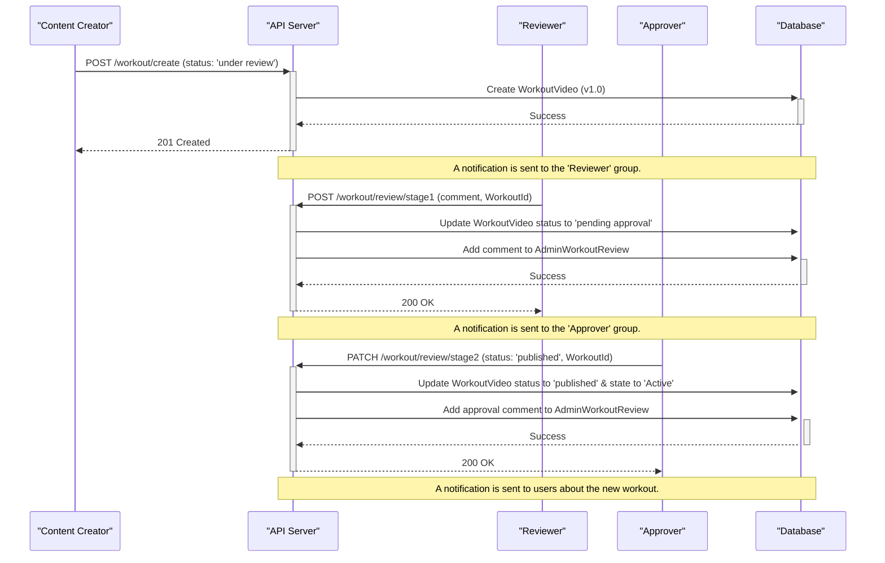
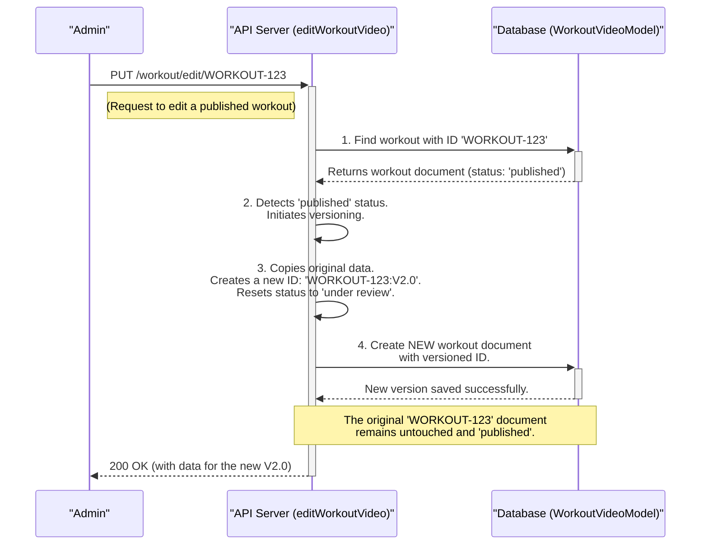
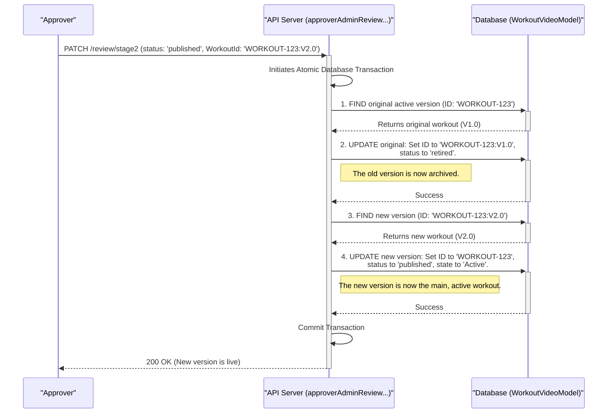

# Workout Management System Architecture

## 1. Overview

The Workout Management System is a comprehensive, lifecycle-driven framework for creating, reviewing, publishing, and maintaining workout video content. It's designed not just as a simple CRUD system, but as a robust content pipeline that ensures quality control through a multi-stage approval process and maintains content integrity with a sophisticated versioning system.

This architecture handles everything from managing basic workout attributes (like intensity and equipment) to the complex flow of a video from a draft to a published, and eventually, a retired state. It securely delivers media using pre-signed URLs and provides detailed analytics on user engagement.

### Key Architectural Features:
- **Full Content Lifecycle**: Workouts move through distinct states: `draft` -> `under review` -> `pending approval` -> `approved`/`published` or `rejected` -> `retired`.
- **Versioning for Published Content**: To maintain the integrity of live content, editing a `published` workout automatically creates a new, versioned copy for review, leaving the original untouched until the new version is approved.
- **Role-Based Approval Workflow**: A formal, two-stage review process involving distinct `Reviewer` and `Approver` groups, whose members are managed by the Access Control System.
- **Secure & Performant Media Delivery**: Leverages AWS S3 and CloudFront with pre-signed URLs to deliver video and thumbnail content securely and efficiently, without exposing public bucket access.
- **Data Composition & Enrichment**: Endpoints are designed to orchestrate and compose data from multiple database models (`WorkoutVideo`, `AdminWorkoutReview`, `User`, `Profile`, etc.) into a single, rich response for the frontend.
- **Modular Design**: The system is logically separated into two main parts: the management of simple workout attributes and the complex lifecycle management of the core workout videos.

---

## 2. System Components & Data Flow

The architecture is a collaboration between the API, multiple database models, and external AWS services.

<div style={{ textAlign: 'center' }}>
  
  <p style={{ fontSize: '0.9em', color: '#888' }}>*High-Level System Architecture*</p>
</div>

---

## 3. The Workout Content Lifecycle

The core of this architecture is the state machine that defines a workout's journey from creation to retirement.

### The Review & Approval Workflow

This sequence diagram illustrates the "happy path" of a new workout version being created, reviewed, and finally published.



### Breakdown of Lifecycle Stages:

<Steps>
### Step 1: Creation (`draft` or `under review`)
- A content creator (an Admin or Coach) creates a new workout. They can either save it as a `draft` for later, or submit it directly, which sets the status to `under review`.
- The `` `createWorkoutVideo` `` and `` `saveAsDraftWorkoutVideo` `` controllers handle this. An entry is also created in the `` `WorkoutOwner` `` model to track authorship.

### Step 2: Stage 1 Review (`pending approval`)
- A member of the `Reviewer` group (as defined in the Access Control system) fetches workouts `under review`.
- They use the `` `reviewerAdminReview` `` controller to submit their feedback.
- This action adds their comments to the `` `AdminWorkoutReview` `` model and automatically transitions the workout's status to `pending approval`.

### Step 3: Stage 2 Approval (`published` or `rejected`)
- A member of the `Approver` group fetches workouts `pending approval`.
- They use the `` `approverAdminReviewForWorkout` `` controller to make the final decision.
- **If approved**: The status is set to `published` and the `state` becomes `Active`. The workout is now live for users.
- **If rejected**: The status is set to `rejected`, and the workout is sent back in the workflow.

### Step 4: Versioning on Edit
- If an admin tries to edit a workout that is already `published` using the `` `editWorkoutVideo` `` controller, the system's versioning logic is triggered.
- Instead of overwriting the live workout, it creates a **new document** with a versioned ID (e.g., `WORKOUT-123:V2.0`).
- This new version starts its lifecycle back at `under review`, while the original version (`WORKOUT-123`) remains `published` and visible to users.
- If the new version is eventually approved and published, the `` `approverAdminReviewForWorkout` `` controller will atomically:
    1.  Retire the old version by changing its status to `retired`.
    2.  Promote the new version by updating its ID to the original base ID (e.g., `WORKOUT-123`) and setting its status to `published`.

### Step 5: Retirement
- An admin with the correct permissions can retire a live workout using the `` `retireWorkoutById` `` controller.
- This sets the workout's status to `retired` and `state` to `Inactive`, removing it from public view while preserving it in the database for historical records.
</Steps>

---

## 4. The Versioning & Content Integrity System

### The Versioning Flow: A Visual Guide

This diagram illustrates the state changes in the database as a workout goes through the edit and re-approval process.

<div style={{ textAlign: 'center' }}>
  
  <p style={{ fontSize: '0.9em', color: '#888' }}>*Workout Versioning Lifecycle*</p>
</div>

A fundamental challenge in any content management system is handling edits to content that is already live and being consumed by users. A simple database `UPDATE` on a published workout is risky and can lead to inconsistencies. This architecture solves the problem with a robust **"New Version on Edit"** strategy.

### The Problem: Why Not Just Overwrite?

Imagine an admin needs to fix a typo or change the equipment for a popular, `published` workout. A direct update would cause several issues:
- **User Disruption**: Users currently following the workout might see content change abruptly.
- **Loss of History**: Analytics and user feedback for the original version would become conflated with the new version.
- **No Quality Control**: The edit would bypass the entire review and approval workflow, increasing the risk of errors going live.

### The Solution: "Copy-on-Edit" Workflow

Instead of overwriting, the system creates a new, independent version of the workout, ensuring the live version remains stable and untouched until the new one is fully approved.

#### Part 1: Triggering a New Version on Edit

This flow is initiated when an admin tries to edit a workout that is already in a `published` state.



**Breakdown of the Edit Process:**
1.  **The Trigger**: An admin sends a `PUT` request to the `` `/api/.../workout/edit/:WORKOUT_ID` `` endpoint for a `published` workout.
2.  **State Detection**: The `` `editWorkoutVideo` `` controller fetches the workout and checks its `status`. It sees the status is `published` and immediately pivots to the versioning logic.
3.  **In-Memory Copy**: It creates a new workout object in memory, copying all data from the original. It then applies the edits from the request body to this new object.
4.  **New Version Creation**: It assigns this new object a **versioned ID** (e.g., `WORKOUT-123:V2.0`) and resets its `status` to `under review`.
5.  **Database Insert**: This new version is saved to the database as a completely separate document. The original, `published` workout remains untouched and continues to be served to users.

#### Part 2: The "Go-Live" Switch - Promoting the New Version

The new version (`WORKOUT-123:V2.0`) goes through the full, independent review cycle. Once an `Approver` decides to publish it, the most critical part of the process occurs: the atomic switch.


**Breakdown of the Approval Switch:**
1.  **The Trigger**: An `Approver` calls the `` `/api/.../review/stage2` `` endpoint, setting the `status` to `published` for the versioned workout (`WORKOUT-123:V2.0`).
2.  **Atomic Transaction**: The `` `approverAdminReviewForWorkout` `` controller starts a database transaction to ensure all subsequent steps either succeed or fail together, preventing data corruption.
3.  **Retire the Old Version**: It finds the current live workout (with the base ID `WORKOUT-123`) and updates it. Its `status` is changed to `retired`, and its ID is permanently set to its historical version (e.g., `WORKOUT-123:V1.0`).
4.  **Promote the New Version**: It takes the newly approved workout (`WORKOUT-123:V2.0`) and updates its `WORKOUT_ID` to the **base ID** (`WORKOUT-123`). Its `status` is set to `published` and `state` to `Active`.
5.  **Commit**: The transaction is committed. The "go-live" switch is now complete. The base ID `WORKOUT-123` now seamlessly points to the new content.

### Fetching Content: How the System Displays the Correct Version

The versioning complexity is completely hidden from end-users and is handled intelligently on the backend.

<Card title="Fetching a Single Workout" icon="video">
  When a user or admin requests a workout by its base ID (e.g., `` `GET /workout/get/WORKOUT-123` ``), the `` `getWorkoutDetailsWithVersions` `` controller performs the following logic:
  1.  It queries the database for all documents where the `WORKOUT_ID` *starts with* the base ID (`WORKOUT-123`). This fetches all versions.
  2.  From this list of versions, it specifically looks for the one single document that has `status: 'published'` and `state: 'Active'`.
  3.  This "active" version is the one that is returned in the main `activeWorkout` field of the response. All other versions are returned in an `allVersions` array for historical viewing in the admin panel.
  4.  This ensures that any request for a workout by its primary identifier **always** resolves to the correct, live, and approved version.
</Card>

## 5. Core Components Breakdown

### Component 1: Workout Attributes Management
- **Controllers**: `workoutDataController.ts`
- **Purpose**: Provides simple CRUD endpoints for managing the metadata used to categorize workouts. This includes `Calories`, `Duration`, `Intensity`, `Equipment`, `FocusArea`, and `ExerciseLevel`.
- **Functionality**: These controllers are straightforward and are responsible for populating the dropdowns and selection options in the workout creation form in the admin panel.

### Component 2: Workout Video Core
- **Controllers**: `addEditWorkout.ts`
- **Purpose**: This is the engine that drives the entire workout lifecycle.
- **Key Functions**:
    - **Data Retrieval (`getWorkoutDetails`, `getAllWorkoutsWithFilter`)**: These are complex data composition functions. They fetch a workout and then enrich it with publisher names, reviewer/approver details, and dynamically generated secure media URLs from CloudFront. The `getAllWorkoutsWithFilter` is particularly powerful, with logic to group and display versioned content correctly based on the `showVersions` flag.
    - **Lifecycle Management (`create`, `edit`, `review`, `approve`, `retire`)**: These functions implement the state transitions described in the lifecycle section, handle database updates, and trigger notifications.
    - **Analytics (`getWorkoutViewers`, `getWorkoutAnalytics`)**: These endpoints query related models like `` `UserWorkoutVideoViewedModel` `` and `` `UserLike` `` to provide engagement metrics for a specific workout.

### Component 3: Secure Media Handling
- **Middleware**: `` `authenticateCognitoUser` `` in `helperFunctionVerifyUserGenTempCred.ts`.
- **Utilities**: `getSignedUrl`, `generateCloudFrontSignedUrl`.
- **Functionality**:
    1.  The `` `authenticateCognitoUser` `` middleware runs on protected routes. It verifies the user's Cognito token and uses it to obtain temporary AWS credentials.
    2.  These temporary credentials are attached to the `request` object.
    3.  When a controller like `` `getWorkoutDetails` `` needs to serve a video, it uses these credentials to call utility functions that generate a short-lived, secure, pre-signed URL for the media file in S3/CloudFront.
    4.  This secure URL is sent to the frontend, which can then render the video or thumbnail without ever having direct access to the S3 bucket.

## 6. API Endpoint Groups

| Group | Purpose | Example Endpoint |
| :--- | :--- | :--- |
| **Workout Attributes** | Manage metadata like intensity, duration, etc. | `POST /calories/create` |
| **Workout Creation** | Create new workouts or save them as drafts. | `POST /workout/create` |
| **Workout Lifecycle** | Edit, review, approve, and retire workouts. | `PUT /workout/edit/:id` |
| **Data Retrieval** | Fetch workout details, lists, and versions. | `GET /workout/get/:id` |
| **Analytics** | Get viewer and engagement statistics. | `GET /workout/analytics/:id` |
```