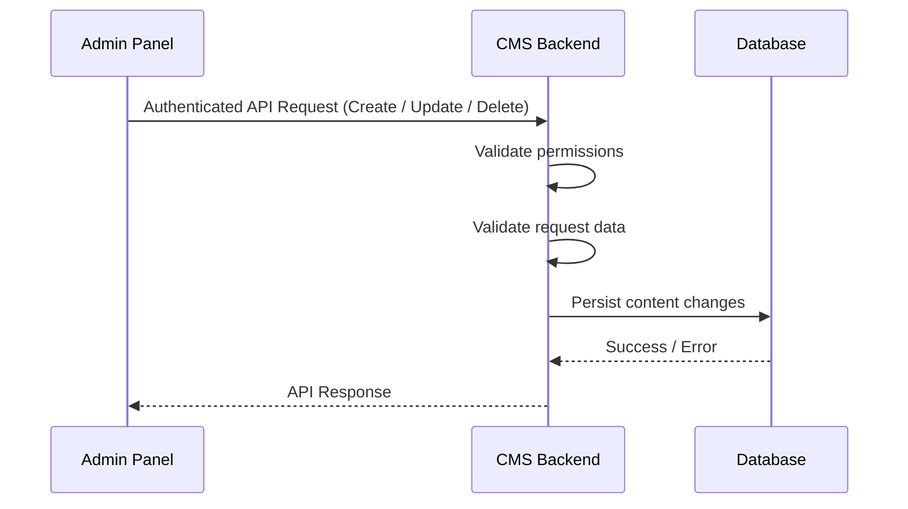
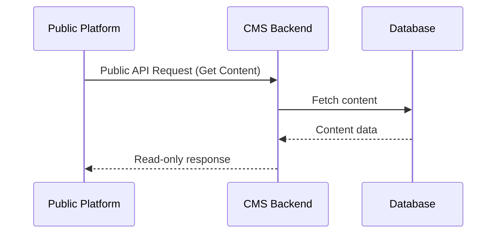

# CMS Architecture Guide

## Purpose

This document describes the **high-level architecture** of the CMS module and explains **how different system components interact** to manage and serve content.

It focuses on **structure and communication**, not implementation details.

---

## Architectural Overview

The CMS module acts as a **central content provider** for multiple platforms:

- Admin Panel (content management)
- Public Platforms (Website, Mobile, etc.)

The same CMS backend serves both **protected admin APIs** and **public read-only APIs**, with access controlled by **API boundaries and permissions**, not by content state.

---

## Major Components

### 1. Admin Panel

- Internal frontend used by admins
- Communicates with CMS through **authenticated and permission-protected APIs**
- Responsible for creating, updating, and deleting content

---

### 2. Public Platforms (Website / Mobile)

- Public-facing applications
- Communicate with CMS through **unauthenticated, read-only APIs**
- Only consume and render content
- Cannot modify content

---

### 3. CMS Backend

- Core module responsible for content management
- Validates permissions for admin APIs
- Serves public content via dedicated endpoints
- Acts as the **single source of truth** for all CMS content

---

### 4. Database

- Stores all CMS content
- Owned exclusively by the CMS backend
- Not accessed directly by any frontend or external system

---

## Communication Patterns

### Synchronous Communication

- Admin Panel → CMS Backend (CRUD operations)
- Public Platforms → CMS Backend (read-only access)

All CMS interactions are **request–response based**.

---

### Asynchronous Communication

- None (currently)

The CMS module does not emit events or rely on async messaging.

---

## Data Ownership

- **CMS Backend** owns:

  - Content data
  - Content structure
  - Validation and persistence

- **Admin Panel / Public Platforms**:
  - Do not own CMS data
  - Cannot bypass CMS APIs

---

## Failure Ownership

- Authorization failures → CMS Backend
- Validation failures → CMS Backend
- Database errors → CMS Backend
- Rendering or display issues → Consuming platform (Admin / Website)

---

## Sequence Diagrams

### Admin Content Management Flow

---

### Public Content Consumption Flow

---

## Architectural Constraints

- Content visibility is controlled by **API access**, not by content state
- CMS does not manage publishing workflows
- CMS does not differentiate consumers beyond API boundaries
- Frontends must not assume any hidden content lifecycle

---

## Non-Goals

This document does **not** describe:

- API endpoint definitions
- Database schema or fields
- Business rules or validation logic
- Frontend UI behavior
- Lambda or internal code layering

## Related Documentation

- Database Schema
- Platform-specific API Documentation
- Platform-specific Business Logic
- Lambda Layers Breakdown
