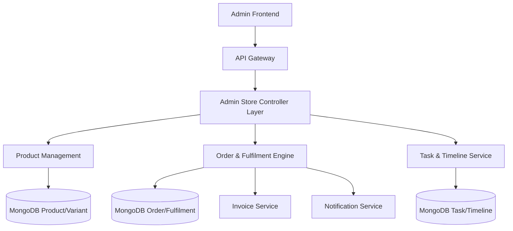

# Store Module Overview (Admin)
The Admin Store Module acts as the command center for the platform's e-commerce operations. It enables administrators to oversee the entire marketplace ecosystem, from product catalog management and inventory control to complex order fulfilment workflows and seller coordination.
## Key Features
- **Product & Catalog Management**: Create, edit, and publish products with support for multiple variants (size, color, etc.) and size guides.
- **Order & Fulfilment Control**: Granular visibility into orders, split by seller (Fulfilments). Ability to update shipping status, tracking IDs, and delivery states.
- **Task Management System**: Internal ticketing system to assign specific fulfilment tasks to Sub-Admins (`SUBADMIN2`) for focused resolution.
- **Financial Oversight**: Manage seller payments, view penalties, generate invoices, and process refunds.
- **Communication Hub**: Centralized timeline for internal notes (comments) on tasks and fulfilments, plus automated notifications to users and admins.
- **Analytics & Reviews**: Monitor product performance, stock levels (`InStock`/`OutOfStock`), and moderate user reviews.
## User Roles & Permissions
| Role | Capabilities | context |
| :--- | :--- | :--- |
| **Super Admin** | Full access to all modules, financial overrides, and configuration. | Admin Panel |
| **Sub-Admin** | Task-based access (e.g., `VIEW_ORDERS`, `EDIT_PRODUCT`, `CLOSE_TASK`). Assigned specific fulfilments. | Admin Panel |
| **Seller** | (External) Provides products. Payments and performance are monitored here. | Seller Dashboard |
## Platform Implementations
### 🛡️ Admin Panel
**Purpose**: A control interface for platform operators to ensure smooth transaction flow and catalog integrity.
**Key Features**:
- **Product Lifecycle**:
    - **Draft Mode**: Save products as drafts before publishing.
    - **Publish Workflow**: Validate images (3-4 required) and descriptions (< 250 words) before going live.
    - **Variant Control**: Manage stock at both Product and Variant levels.
- **Advanced Order Filtering**: Filter by Date Range, Order ID, Amount, State (e.g., `Order Received`, `Order In Process`, `Completed`), and Fulfilment status.
- **Task Delegation**: Create tasks linked to fulfilments (e.g., "Verify Shipping Doc") and assign them to specific team members.
- **Timeline & Audit**: A "Timeline" feature that logs automated system events and allows admins to add manual comments for internal collaboration.
## High-Level Architecture

### Key Components:

- **Product Controller**: Enforces business rules (image counts, word limits) and handles PROD/VAR ID generation.
- **Order Controller**: The brain of the operation. It calculates complex states (Order In Process, Refund, etc.) based on the aggregate status of individual seller fulfilments.
- **Task Controller**: Manages internal workflow, linking Tasks to Fulfilments and Users (Admins).
- **Notification Utility**: Triggers In-App and Email updates for critical events (Shipped, Delivered, Cancelled).
## Core Data Model
### Product & Variant
- **Product**: The parent entity. Contains baseImages, description, highlights, and aggregate stock.
- **Variant**: The sellable SKU. Overrides price, stock, images. Auto-generated Base Variant mirrors the parent product initially.
- **ID Format**: PRODxxxx, VARxxxx.

### Order, Fulfilment & Task
- **Order**: Aggregate user transaction. Contains technical references like grandTotal.
- **Fulfilment**: The operational unit. Represents a "Split Order" for a specific seller.
  - Fields: trackingId, shippingPartner, assignedTo.
- **Task**: An actionable item for an admin.
  - Fields: taskDetail, taskType (NEW, PROCESSING, DELIVERY), assignedTo (AdminID).
- **Timeline**: Chronological log of comments and status changes linked to Tasks/Fulfilments.
## Key Workflows
1. Product Publishing Flow
Admin creates 'Draft' Product 
→ Adds Images & Variants 
→ Validates Rules (Word count, Image count) 
→ Sets State to 'Publish' 
→ System Auto-creates Base Variant (if missing)
2. Order Fulfilment & Task Assignment
Order Received (Split into Fulfilments) 
→ Admin Creates 'Task' for a Fulfilment 
→ Assigns to Sub-Admin 
→ Sub-Admin updates Fulfilment (e.g., adds Tracking ID) 
→ Order State Auto-Updates (e.g., to 'Order In Process')
3. Refunds & Cancellations
Returns Requested 
→ Admin reviews proof (User uploads) 
→ Process Refund via Razorpay/Wallet 
→ Update Fulfilment Status to 'Refunded'/'Rejected' 
→ Notify User
## Module Dependencies
Depends On
Authentication: authenticateAdminToken for verifying admin sessions.
Access Management: RBAC Middleware (authorize('CREATE_PRODUCT'), etc.).
ID Generation: Middleware for consistent ID sequences (PROD, TASK, VAR).
Notification Infrastructure: Shared sendInAppNotification and shootMail utilities.
## Tech Stack
Backend: Node.js, Express (Controller-based).
Database: MongoDB (Mongoose) with complex Relational-like lookups (e.g., Orders ↔ Fulfilments ↔ Tasks).
