**Database**: MongoDB  
**Module Type**: Core E-Commerce Platform  
**Last Updated**: January 2026

---

## Key Features

### For End Users (Website)

- **Product Discovery**: Advanced search, filtering (by price, rating, color, size, category), and sorting.
- **Product Management**: Support for multiple product variants (size, color) with real-time stock tracking.
- **Shopping Cart**: Persistent cart sessions, quantity management, and stock validation.
- **Checkout & Global Payment**: Secure storage of shipping addresses and integration with payment gateways (Razorpay).
- **Order Management**: Detailed order tracking, split fulfilments for multi-vendor orders, and invoice generation.
- **Reviews & Ratings**: User-generated reviews with media uploads to build trust.
- **Wishlist**: "Like" functionality to save products for later.

### For Administrators (Admin Panel)

- **Product & Catalog Management**: Create, edit, and publish products with support for multiple variants and size guides.
- **Order & Fulfilment Control**: Granular visibility into orders, split by seller. Ability to update shipping status, tracking IDs, and delivery states.
- **Task Management System**: Internal ticketing system to assign specific fulfilment tasks to Sub-Admins for focused resolution.
- **Financial Oversight**: Manage seller payments, view penalties, generate invoices, and process refunds.
- **Communication Hub**: Centralized timeline for internal notes on tasks and fulfilments, plus automated notifications.
- **Analytics & Reviews**: Monitor product performance, stock levels, and moderate user reviews.

---

## User Roles & Permissions

| Role | Capabilities | Platform Access |
| :--- | :--- | :--- |
| **End User** | Browse products, manage cart, place orders, write reviews, manage addresses | Website |
| **Seller** | Manage inventory, view earnings, process fulfilments | Seller Dashboard |
| **Super Admin** | Full access to all modules, financial overrides, and configuration | Admin Panel |
| **Sub-Admin** | Task-based access (e.g., `VIEW_ORDERS`, `EDIT_PRODUCT`, `CLOSE_TASK`). Assigned specific fulfilments | Admin Panel |

---

## Platform Implementations

### 🌐 Website (Public & Authenticated)

**Purpose**: A full-featured e-commerce storefront for browsing and purchasing wellness products.

**Key Features**:

- **Dynamic Product Listing**: Grid view with quick filters for `Best Seller`, `product Name`, and `Free Delivery`.
- **Product Details Page (PDP)**: High-resolution image galleries, size guides, variant selection, and similar product recommendations.
- **Smart Cart**: Real-time stock validation before checkout to prevent overselling.
- **User Account Area**: Management of saved addresses, order history views, and refund tracking.

**User Journey**: User browses "Yoga Mats" → Selects "Blue" variant → Adds to Cart → Completes Checkout → Receives Order Confirmation.

---

### 🛡️ Admin Panel

**Purpose**: A control interface for platform operators to ensure smooth transaction flow and catalog integrity.

**Key Features**:

- **Product Lifecycle**:
  - **Draft Mode**: Save products as drafts before publishing.
  - **Publish Workflow**: Validate images (3-4 required) and descriptions (< 250 words) before going live.
  - **Variant Control**: Manage stock at both Product and Variant levels.

- **Advanced Order Filtering**: Filter by Date Range, Order ID, Amount, State (e.g., `Order Received`, `Order In Process`, `Completed`), and Fulfilment status.

- **Task Delegation**: Create tasks linked to fulfilments (e.g., "Verify Shipping Doc") and assign them to specific team members.

- **Timeline & Audit**: A "Timeline" feature that logs automated system events and allows admins to add manual comments for internal collaboration.

---

## High-Level Architecture

```mermaid
graph TD
    subgraph Website["🌐 Website Layer"]
        A[Web Frontend]
    end
    subgraph Admin["🛡️ Admin Layer"]
        B[Admin Frontend]
    end
    subgraph Gateway["API Layer"]
        C[API Gateway]
    end
    subgraph Services["Service Layer"]
        D[Product Service]
        E[Order Service]
        F[Cart Service]
        G[Task & Timeline Service]
        H[Invoice Service]
        I[Notification Service]
    end
    subgraph Database["Data Layer"]
        J[(MongoDB Product/Variant)]
        K[(MongoDB Order/Fulfilment)]
        L[(MongoDB Task/Timeline)]
        M[(MongoDB Cart)]
    end
    subgraph External["External Services"]
        N[Payment Gateway]
        O[FCM/Email Service]
    end
    
    A --> C
    B --> C
    C --> D
    C --> E
    C --> F
    C --> G
    D --> J
    E --> K
    E --> N
    E --> I
    F --> M
    G --> L
    H --> K
    I --> O
```



**Key Components**:

- **Product Controller**: Handles fetching products, variants, and validation logic. Enforces business rules (image counts, word limits) and handles PROD/VAR ID generation.
- **Order Controller**: Manages complex transaction flows, including splitting orders into `Fulfilments` per seller. Calculates complex states based on aggregate fulfilment status.
- **Cart Controller**: Manages temporary product storage and state with real-time validation.
- **Task Controller**: Manages internal workflow, linking Tasks to Fulfilments and Users (Admins).
- **MongoDB**: Stores relational data like `Products`, `Variants`, `Orders`, `Fulfilments`, `Tasks`, and `Cart`.

---

## Core Data Model

### Product & Variant

- **Product**: Base info (`name`, `description`, `category`, `basePrice`, `reviewIds`, `variants`).
- **Variant**: Specific SKU details (`size`, `color`, `stock`, `price` override, `images`).
- **Inventory**: Tracked at both Product and Variant levels (`inventoryStatus`).
- **ID Format**: PRODxxxx, VARxxxx.

### Order, Fulfilment & Task

- **Order**: The aggregate user transaction (`grandTotal`, `shippingAddress`, `paymentStatus`). Contains technical references and splits into fulfilments.
- **Fulfilment**: The operational unit representing a "Split Order" for a specific seller. Fields: `trackingId`, `shippingPartner`, `assignedTo`, `fitcartCommissionRate`, `amountPaidToSeller`.
- **Task**: An actionable item for an admin. Fields: `taskDetail`, `taskType` (NEW, PROCESSING, DELIVERY), `assignedTo` (AdminID).
- **Timeline**: Chronological log of comments and status changes linked to Tasks/Fulfilments.

### Cart

- **Cart**: Stores temporary product selections per user.
- Contains items with variant references, quantity, and pricing snapshots.

### Review

- User ratings and text feedback.
- Associated media (photos) linked to products.
- Can be applied to Products, Studios, Coaches, and Workouts.

---

## Key Workflows

### 1. Purchase Flow (Website)

```
User Adds Items to Cart 
  → Proceeds to Checkout 
  → Selects Address 
  → Validates Stock 
  → Processes Payment (Razorpay) 
  → Order Created (Split into Fulfilments) 
  → Notification Sent (FCM/Email)
```

### 2. Product Publishing Flow (Admin)

```
Admin Creates 'Draft' Product 
  → Adds Images & Variants 
  → Validates Rules (Word count, Image count) 
  → Sets State to 'Publish' 
  → System Auto-creates Base Variant (if missing)
```

### 3. Order Fulfilment & Task Assignment (Admin)

```
Order Received (Split into Fulfilments) 
  → Admin Creates 'Task' for a Fulfilment 
  → Assigns to Sub-Admin 
  → Sub-Admin Updates Fulfilment (e.g., adds Tracking ID) 
  → Order State Auto-Updates (e.g., to 'Order In Process')
```

### 4. Refund/Cancellation (Website & Admin)

```
User Requests Refund 
  → Request Logged in RefundModel 
  → Admin/Seller Approves 
  → Refund Processed (via Razorpay/Wallet) 
  → Order/Fulfilment Status Updated
  → Notify User
```

### 5. Inventory Management (Auto)

```
Order Placed 
  → Stock Deducted from Product/Variant 
  → If Stock <= 0, Status Updates to 'OutOfStock'
```

---

## Module Dependencies

### Depends On

- **Authentication Module**: For user identification (`userId` in requests) and admin session verification (`authenticateAdminToken`).
- **Notification Module**: Sending order updates via Email/Push (FCM).
- **Payment Module**: Handling transactions and refunds (Razorpay).
- **Access Management**: RBAC Middleware (`authorize('CREATE_PRODUCT')`, etc.) for permission enforcement.
- **Common Utils**: Shared models and utilities (`@fit-earn-meditate/backend-shared-models`), ID generation middleware.

### Provides

- Product catalog and variant management endpoints.
- Order and fulfilment tracking APIs.
- Cart management APIs.
- Payment and refund processing.
- Review and rating system.

---

## Tech Stack

- **Backend**: Node.js, Express (Controller-based architecture).
- **Database**: MongoDB (Mongoose ORM) with complex relational-like lookups (Orders ↔ Fulfilments ↔ Tasks).
- **Payment Integration**: Razorpay API.
- **Utilities**: `generateUniqueSequence` for IDs, Custom Middleware for Validation, FCM/Email services.

---

## Data Flow Summary

```
Website Layer                          Admin Layer
     ↓                                    ↓
  User Browse              ←→          Admin Manage
  Add to Cart              ←→          Create Products
  Checkout                 ←→          Publish Catalog
     ↓                                    ↓
     └─→ Order Service ←────────────────┘
            ↓
         Razorpay (Payment)
            ↓
         Order Created
            ↓
      Split into Fulfilments
            ↓
      Task Creation & Assignment
            ↓
      Timeline & Notifications
            ↓
      Inventory & Invoice
```

---

## Summary

The Store module forms the backbone of the e-commerce platform, seamlessly integrating user-facing shopping experiences with sophisticated backend management tools. It handles the complete transaction lifecycle while maintaining data integrity, financial accuracy, and operational transparency across all marketplace participants.