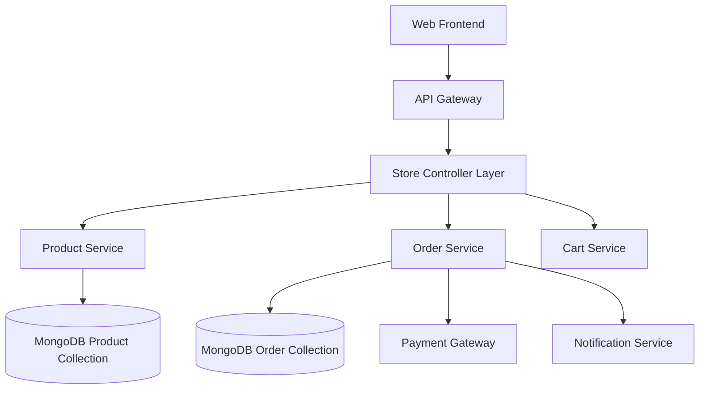

# Store Module Overview

The Store module powers the e-commerce capabilities of our platform, facilitating a seamless shopping experience for users. It manages the entire lifecycle of a transaction, from product discovery and viewing to cart management, secure checkout, and order fulfilment.

## Key Features

- **Product Discovery**: Advanced search, filtering (by price, rating, color, size, category), and sorting.
- **Product Management**: Support for multiple product variants (size, color) with real-time stock tracking.
- **Shopping Cart**: Persistent cart sessions, quantity management, and stock validation.
- **Checkout & Global Payment**: Secure storage of shipping addresses and integration with payment gateways (Razorpay).
- **Order Management**: Detailed order tracking, split fulfilments for multi-vendor orders, and invoice generation.
- **Reviews & Ratings**: User-generated reviews with media uploads to build trust.
- **Wishlist**: "Like" functionality to save products for later.

## User Roles & Permissions

| Role | Capabilities | Platform Access |
| :--- | :--- | :--- |
| **End User** | Browse products, manage cart, place orders, write reviews, manage addresses | Website |
| **Seller** | Manage inventory, view earnings, process fulfilments (Inferred) | Seller Dashboard |
| **Admin** | Manage catalogue, oversee orders, handle refunds/disputes | Admin Panel |

## Platform Implementations

### 🌐 Website (Public & Authenticated)

**Purpose**: A full-featured e-commerce storefront for browsing and purchasing wellness products.

**Key Features**:
- **Dynamic Product Listing**: Grid view with quick filters for `Best Seller`, `product Name`, and `Free Delivery`.
- **Product Details Page (PDP)**: High-resolution image galleries, size guides, variant selection, and similar product recommendations.
- **Smart Cart**: Real-time stock validation before checkout to prevent overselling.
- **User Account Area**: Management of saved addresses, order history views, and refund tracking.

**User Journey**: User browses "Yoga Mats"  → Selects "Blue" variant → Adds to Cart → Completes Checkout → Receives Order Confirmation.

## High-Level Architecture



**Key Components**:
- **Product Controller**: Handles fetching products, variants, and validation logic.
- **Order Controller**: Manages complex transaction flows, including splitting orders into `Fulfilments` per seller.
- **Cart Controller**: Manages temporary product storage and state.
- **MongoDB**: Stores relational data like `Products`, `Variants`, `Orders`, and `UserLikes`.

## Core Data Model

### Product & Variant
- **Product**: Base info (`name`, `description`, `category`, `basePrice`, `reviewIds`).
- **Variant**: Specific SKU details (`size`, `color`, `stock`, `price` override, `images`).
- **Inventory**: Tracked at both Product and Variant levels (`inventoryStatus`).

### Order & Fulfilment
- **Order**: The aggregate transaction (`grandTotal`, `shippingAddress`, `paymentStatus`).
- **Fulfilment**: Sub-order unit per seller/item. Tracks specific shipping status, commission (`fitcartCommissionRate`), and seller payout (`amountPaidToSeller`).
- **Payment**: Linked via `transactionId` and `SellerPayment` records.

### Review
- User ratings and text feedback.
- Associated media (photos) linked to products.

## Key Workflows

### 1. Purchase Flow
```
User Adds Items to Cart → Proceeds to Checkout → Selects Address 
→ Validates Stock 
→ Processes Payment (Razorpay) 
→ Order Created (Split into Fulfilments) 
→ Notification Sent (FCM/Email)
```

### 2. Refund/Cancellation
```
User Requests Refund → Request Logged in RefundModel 
→ Admin/Seller Approves 
→ Refund Processed 
→ Order/Fulfilment Status Updated
```

### 3. Inventory Management (Auto)
```
Order Placed → Stock Deducted from Product/Variant 
→ If Stock <= 0, Status updates to 'OutOfStock'
```

## Module Dependencies

### Depends On
- **Authentication Module**: For user identification (`userId` in requests).
- **Notification Module**: Sending order updates via Email/Push.
- **Payment Module**: Handling transactions (Razorpay).
- **Common Utils**: Shared models (`@fit-earn-meditate/backend-shared-models`).

## Tech Stack (Inferred)

- **Backend**: Node.js, Express (Controller-based architecture).
- **Database**: MongoDB (Mongoose ORM).
- **Utilities**: `generateUniqueSequence` for IDs, Custom Middleware for Validation.
