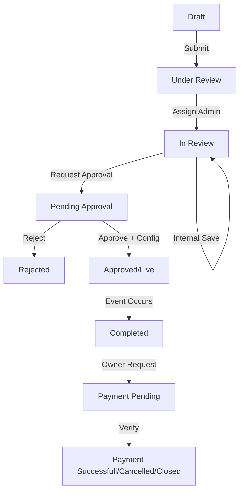

This module manages the end-to-end lifecycle of live events, from creation and multi-step administrative review to real-time monitoring and post-event settlement.

## 1. High-Level Component Overview

- **Creation Engines:**
  - _Owner App:_ Owners create sessions for their own studios.
  - _Admin Panel:_ Authorized admins create sessions and assign them to specific studios.
- **Review System:** A tiered workflow involving "Reviewers" and "Approvers."
- **Live Infrastructure:** Integration with meeting providers (e.g., Zoom/Agora) and a Moderator interface for online sessions.
- **Settlement Engine:** Processes payment requests based on pre-defined owner agreements.

## 2. State Transition Diagram (The Review Loop)

The system uses a strict state machine to ensure quality control:

