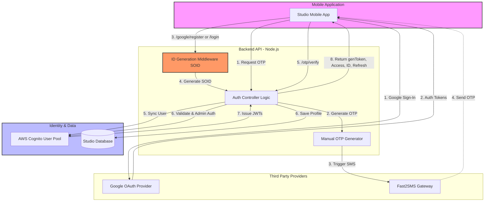

## Overview

The Studio App uses a hybrid authentication architecture. It leverages **AWS Cognito** as the primary Identity Provider (IdP) for token management, while utilizing a custom backend logic for manual OTP generation and delivery via **Fast2SMS**.

The system supports two primary entry points:

1.  **Social Authentication**: Google/Gmail Sign-in/Sign-up.
2.  **Phone Authentication**: OTP-based Sign-in/Sign-up with manual verification logic.

## System Components

| Component       | Role                                                                           |
| :-------------- | :----------------------------------------------------------------------------- |
| **Mobile App**  | Client interface for user interaction and token storage.                       |
| **Backend API** | Node.js/Express service handling business logic and ID generation.             |
| **AWS Cognito** | Manages user pools and issues JWTs (`accessToken`, `idToken`, `refreshToken`). |
| **Fast2SMS**    | External SMS gateway used to deliver OTPs to users.                            |
| **Database**    | Stores Studio Owner metadata linked to Cognito identities via `SOID`.          |

---

## Authentication Flows

### 1. Google OAuth Flow

This flow handles both new registrations and returning users via Google.

<Steps>
  <Step title="Client Initiation">
    The mobile app obtains the Google Identity tokens and sends them to the
    `/google/register` or `/google/login` endpoint.
  </Step>
  <Step title="ID Generation (Signup Only)">
    The `idGenerationMiddleware('SOID')` triggers for new users, creating a
    unique `SOIDxxxxx` identifier.
  </Step>
  <Step title="Cognito Integration">
    The backend communicates with AWS Cognito to either create a new user record
    or verify the existing one using the Google `accessToken`.
  </Step>
  <Step title="Token Issuance">
    Cognito generates the standard OIDC tokens. The backend wraps these into a
    `genToken` object and returns them to the client.
  </Step>
</Steps>

### 2. Manual OTP Flow (Fast2SMS)

Unlike standard Cognito SMS flows, this system uses a manual generation logic to allow for custom SMS providers like Fast2SMS.

<Steps>
  <Step title="Request OTP">
    User enters their mobile number. The backend checks if the user exists
    (Login) or is new (Register).
  </Step>
  <Step title="Manual Generation">
    The server generates a 4-6 digit numeric code and stores it in a temporary
    cache (e.g., Redis or DB) with a TTL (Time-to-Live).
  </Step>
  <Step title="Fast2SMS Delivery">
    The backend triggers the Fast2SMS API to send the generated OTP to the
    user's device.
  </Step>
  <Step title="Verification">
    The user submits the OTP via `/otp/verify`. The backend validates the code
    against the stored value.
  </Step>
  <Step title="Cognito Token Exchange">
    Upon successful verification, the backend programmatically authenticates the
    user in Cognito (using Admin/Custom flows) to retrieve the JWT stack.
  </Step>
</Steps>

---

## Architectural Diagram



## Key Improvements Explained

### Middleware Integration:

The idGenerationMiddleware('SOID') is now placed at the start of the Google Registration flow, showing how the unique Studio Owner ID is injected before hitting the controller.

### Manual OTP Decoupling:

The diagram explicitly shows the Backend API generating the OTP manually rather than letting Cognito handle the SMS. This highlights your use of Fast2SMS as the delivery mechanism.

### Unified Identity Layer:

Even though you have two signup methods, both converge at AWS Cognito. This clarifies that Cognito is your single "Source of Truth" for tokens, regardless of how the user verified their identity.

### Token Clarity:

The final step (Step 8) specifically lists the tokens mentioned in your API ( genToken, accessToken, idToken, and refreshToken).

### Data Persistence:

It shows the dual action of syncing the user to Cognito while simultaneously saving owner metadata to your internal Studio Database.

## Token Management

The system issues four specific tokens upon successful authentication to ensure security and session persistence:

### Token Types

- genToken: A custom-signed internal token used for specific backend session tracking.

- accessToken: Short-lived JWT used to authorize requests to protected API resources.

- idToken: Contains user profile claims (email, name, SOID).

- refreshToken: Long-lived token used to obtain new access tokens without re-authenticating.

### Security Implementation

### Middleware:

The idGenerationMiddleware ensures that every Studio Owner has a unique internal reference ID (SOID) mapped across the database and Cognito.

### Validation:

All incoming requests to protected routes must provide the accessToken in the Authorization header.

## Error Handling Architecture

The module follows a standardized error response structure:

Status Code Scenario

- 400 Bad Request Missing parameters or invalid OTP.
- 403 Forbidden Account deleted or temporary login ban (15-day rule).
- 404 Not Found User does not exist during a Login attempt.
- 409 Conflict Mobile number/Email already exists during Registration.
- 500 Internal Error Fast2SMS gateway failure or Cognito service interruption.
  Integration Notes
- HashCode: The OTP endpoints require a hashCode. This is used by the mobile app's SMS Retriever API (Android) to automatically read the OTP.
- Onboarding State: The /otp/verify and Google login responses include onBoardComplete. This flag determines if the app should redirect the user to the dashboard or the profile setup screen.

---

```

| Error Code | HTTP Status | Scenario                   | User Message                                 | Backend Action  |
| ---------- | ----------- | -------------------------- | -------------------------------------------- | --------------- |
| `AUTH_001` | 400         | Missing email/phone        | "Email or phone required"                    | Return error    |
| `AUTH_002` | 409         | Email/phone already exists | "Account already exists. Please login."      | Check DB        |
| `AUTH_003` | 404         | Account not found          | "Account not found. Please sign up."         | Check DB        |
| `AUTH_004` | 403         | Account deleted            | "Account deleted. Cannot login for 15 days." | Check deletedAt |
| `AUTH_005` | 403         | Account suspended          | "Account suspended. Contact support."        | Check stage     |
| `AUTH_006` | 400         | Invalid OTP                | "Invalid or expired OTP. Please try again."  | Validate OTP    |
| `AUTH_007` | 429         |

```
