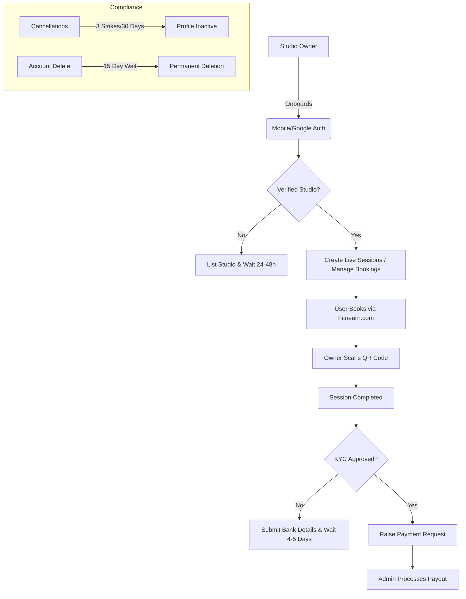

This documentation provides a comprehensive overview of the **Fitnearn Studio Owner Mobile Application**. It details the app's structure, feature modules, and the technical logic governing the relationship between Studio Owners, Admin Panels, and End Users.

---

# Fitnearn Studio: Architecture & Overview

## 1. Executive Summary

The Fitnearn Studio App is a B2B platform designed for fitness professionals and studio owners. It enables them to onboard their physical fitness centers (gyms, yoga studios, dance academies) and digital services (live sessions) onto the Fitnearn ecosystem.

The app acts as a management suite where owners handle bookings, verify customer attendance via QR codes, manage financial transactions, and host live sessions.

---

## 2. High-Level Architecture

The application follows a **Client-Server-Admin** architecture. The Studio App interacts with a centralized backend that synchronizes data across three primary interfaces:

1.  **Studio Owner App (Mobile):** The management interface for service providers.
2.  **End-User App/Web (Fitnearn.com):** The marketplace where customers discover and book sessions.
3.  **Admin Panel (Web):** The regulatory body that verifies KYC, approves listings, and processes payments.

### Technical Stack Highlights

- **Authentication:** Dual-factor (Mobile Number + OTP) and Social Auth (Google).
- **Communication:** RESTful APIs with JWT-based `authenticateStudioToken` middleware.
- **Storage:** Cloud-based (S3) for profile images, studio photos, and KYC documents.
- **Real-time:** Push Notification system for booking alerts and approval status.

---

## 3. Core Feature Modules

### A. Onboarding & KYC Module

- **Entry:** Owners sign up via Mobile/OTP or Google.
- **KYC Requirement:** To receive payments, owners must submit bank details and identity verification.
- **SLA:** Admin review for KYC takes **4–5 business days**.
- **Constraint:** Payment requests are locked until KYC is "Approved."

### B. Studio Management (Offline)

- **Listing:** Owners can list multiple types of fitness entities.
- **Verification:** Once submitted, a studio undergoes a **24–48 hour** verification window.
- **Visibility:** Studios only appear on _Fitnearn.com_ after Admin Approval.
- **Editing:** If rejected, owners receive specific feedback to edit and resubmit.

### C. Booking & Verification (QR System)

- **Monitoring:** Real-time tracking of offline bookings and user slots.
- **Attendance:** When a user arrives, the owner uses the app's **QR Scanner** to scan the user's code.
- **Validation:** The system checks the validity of the slot and marks the user as "Attended," which is a prerequisite for payment settlement.

### D. Live Session Module

- **Eligibility:** Requires at least one verified physical studio.
- **Lifecycle:** Create → Send for Review → Admin Approval → Live on Website/App.
- **Management:** After rejection, owners can edit session details (intensity, category, etc.) and re-request review.

### E. Payment & Wallet Module

- **Request System:** Owners raise payment requests manually after session completion.
- **Rules:**
  - Payments are only processed for "Completed" sessions.
  - "Cancelled" or "Denied" sessions are ineligible for payouts.
- **Transaction History:** A dedicated tab to monitor credits, debits, and pending settlements.

### F. Notification System

- **Triggers:** Booking confirmations, Admin Approvals/Rejections, Strike alerts, and Payment processing updates.
- **Interface:** Centralized notification tab within the app.

---

## 4. Business Rules & Logic

### Strike & Penalty Mechanism

To ensure high service quality, the app implements a strict cancellation policy:

- **The Rule:** If an owner cancels **3 sessions/bookings within a 30-day window**, they receive 3 strikes.
- **The Consequence:** Upon the 3rd strike, the profile becomes **Inactive**.
- **Impact:** Inactive profiles are hidden from the End-User app; all studios and live sessions associated with the owner are delisted until administrative resolution.

### Account Deletion (Soft Delete)

- **Grace Period:** When an owner deletes their account, it enters a **15-day "Soft Delete" state**.
- **Cooling Off:** The owner cannot log in during these 15 days.
- **Hard Delete:** After the 15th day, the account and all associated data are permanently purged from the production database.

---

## 5. Summary of Service Level Agreements (SLAs)

| Entity               | Action             | Expected Timeframe |
| :------------------- | :----------------- | :----------------- |
| **Studio Listing**   | Admin Verification | 24 - 48 Hours      |
| **KYC/Bank Details** | Admin Approval     | 4 - 5 Days         |
| **Live Session**     | Admin Review       | 24 Hours           |
| **Account Deletion** | Permanent Removal  | 15 Days            |
| **Strike Reset**     | Penalty Window     | 30 Days            |

---

## 6. Architecture Diagram (Logical Flow)

