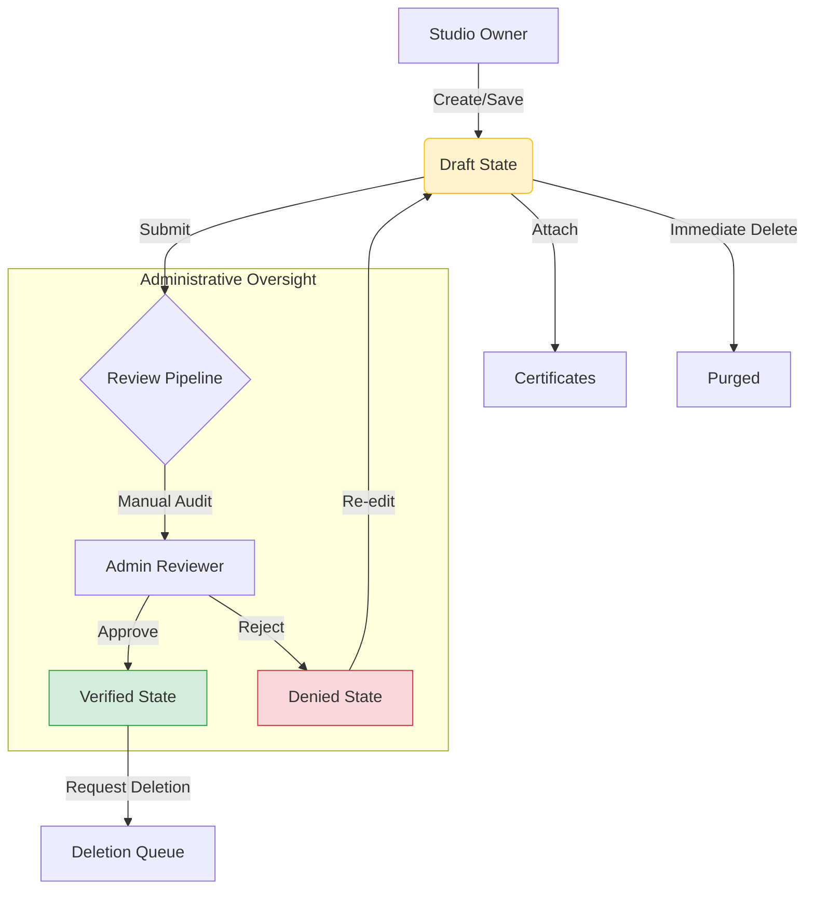

## Module Overview

The Studio Management module handles the end-to-end lifecycle of a physical fitness facility within the platform. It decouples the **Creation (Owner)**, **Validation (System)**, and **Verification (Admin)** phases to ensure data integrity and quality control before a studio goes live.

## Architectural Components

- **Studio Workbench**: A staging area where owners can partially save studio data without affecting the live marketplace.
- **Compliance Engine**: Manages the association of legal certificates to studio entities, ensuring every listing has a verifiable provider and validity period.
- **Review Pipeline**: An asynchronous state-management system that moves studios between the Owner's control and the Admin's oversight.
- **Session Protection Layer**: A safety mechanism that prevents the deletion of active studios if they contain future financial or service obligations (upcoming sessions).

## Lifecycle Workflow

## Data Synchronization

- **Draft Persistence**: Changes are saved locally to the database but are excluded from the public discovery API.
- **Identity Injection**: The `authenticateStudioToken` ensures every studio is strictly bound to a `SOID` (Studio Owner ID), preventing cross-tenant data access.
- **Certificate Binding**: Certificates are treated as child entities. A studio cannot move to a "Verified" state without valid certification data.

---
