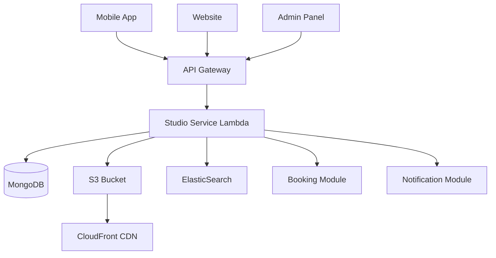

# Studio Module Overview

The Studio module manages the complete lifecycle of studio profiles on our platform. It enables studio owners to create, manage, and showcase their businesses while allowing users to discover and book services at these studios.

## Key Features

- **Profile Management**: Create and edit studio details, photos, services, and operating hours
- **Discovery & Search**: Location-based search, filtering by services, ratings, and availability
- **Verification System**: Admin approval workflow ensuring quality control
- **Analytics Dashboard**: Real-time metrics on views, bookings, and revenue
- **Multi-media Support**: Photo galleries, video tours, and virtual walkthroughs
- **Review & Rating System**: User feedback with moderation capabilities

## User Roles & Permissions

| Role             | Capabilities                                           | Platform Access     |
| ---------------- | ------------------------------------------------------ | ------------------- |
| **Studio Owner** | Manage profile, respond to reviews, view analytics     | Mobile App, Website |
| **End User**     | Browse, search, view profiles, leave reviews           | Mobile App, Website |
| **Admin**        | Approve/reject studios, moderate content, view reports | Admin Panel         |
| **Super Admin**  | Full access, delete studios, manage permissions        | Admin Panel         |

## Platform Implementations

### 📱 Mobile App (Studio Owners)

**Purpose**: On-the-go studio management for busy owners

**Key Features**:

- Quick profile updates (hours, services, pricing)
- Photo uploads with instant sync
- Push notifications for new bookings and reviews
- Offline-first architecture for unreliable connectivity
- QR code generation for in-studio promotions

**User Journey**: Owner receives booking notification → Opens app → Views customer details → Confirms/manages booking

---

### 🌐 Website (Public & Studio Owners)

**Purpose**: SEO-optimized discovery and detailed studio showcases

**Key Features**:

- Public studio directory with advanced filtering
- Dedicated SEO-friendly studio pages (`/studios/[slug]`)
- Map-based discovery with clustering
- Social sharing and embeddable widgets
- Studio owner dashboard for management

**User Journey**: User searches "yoga studios near me" → Filters results → Views studio page → Reads reviews → Books session

---

### 🛠️ Admin Panel

**Purpose**: Platform management and quality control

**Key Features**:

- Studio approval queue with batch operations
- Content moderation (photos, descriptions, reviews)
- Analytics and reporting dashboards
- Manual studio creation for partner onboarding
- Audit logs for all admin actions

**User Journey**: New studio submitted → Admin reviews details → Checks photos/content → Approves/rejects with feedback

## High-Level Architecture



**Key Components**:

- **API Gateway**: Routes all HTTP requests, handles authentication
- **Studio Service Lambda**: Core business logic (CRUD, search, validation)
- **MongoDB**: Primary data store for studio profiles and metadata
- **ElasticSearch**: Powers advanced search and filtering
- **S3 + CloudFront**: Optimized image storage and delivery
- **Redis Cache**: Caches popular studio listings

## Core Data Model

### Studio

- Basic info (name, slug, description, tagline)
- Location (address, coordinates, timezone)
- Services offered with pricing
- Operating hours and holiday schedules
- Contact details (phone, email, social links)
- Media (photos, videos, virtual tours)
- Status (draft, pending, approved, suspended)

### Studio Review

- User rating (1-5 stars)
- Written feedback
- Response from studio owner
- Moderation status

### Studio Analytics

- Daily unique views
- Booking conversion rate
- Average rating trend
- Revenue metrics

## Key Workflows

### 1. Studio Onboarding Flow

```
Owner Signs Up → Creates Studio Profile → Uploads Photos & Details
→ Submits for Review → Admin Reviews → Approved ✓
→ Studio Goes Live → Notification Sent to Owner
```

**Time**: Usually completed in 24-48 hours

### 2. User Discovery Flow

```
User Opens App/Website → Searches by Location/Service
→ Applies Filters (price, rating, availability)
→ Views Studio Profile → Reads Reviews
→ Clicks "Book Now" → Redirects to Booking Module
```

### 3. Profile Update Flow

```
Owner Edits Profile → Changes Saved Locally (mobile)
→ Syncs to Backend → If Major Changes → Admin Re-review
→ Updates Published
```

**Major Changes** (require re-approval): Address change, service category change

## Module Dependencies

### Depends On

- **Authentication Module**: User and studio owner authentication via JWT
- **Payment Module**: Subscription plans for premium studio features
- **Notification Module**: Email/push notifications for bookings and approvals
- **Storage Module**: Image upload and compression utilities

### Used By

- **Booking Module**: Links bookings to specific studios
- **Review Module**: Associates reviews with studios
- **Analytics Module**: Aggregates platform-wide studio metrics
- **Search Module**: Indexes studio data for global search

## Tech Stack

**Backend**:

- Node.js 18.x (AWS Lambda runtime)
- Express.js (API routing)
- MongoDB 6.0 (primary database)
- ElasticSearch 8.x (search indexing)
- Redis 7.x (caching)

**Frontend**:

- React 18 (Website, Admin Panel)
- React Native 0.72 (Mobile App)
- TypeScript 5.x (all platforms)
- Tailwind CSS (styling)

**Infrastructure**:

- AWS Lambda (serverless compute)
- API Gateway (REST APIs)
- S3 (media storage)
- CloudFront (CDN)
- CloudWatch (logging & monitoring)

**Shared Lambda Layers**:

- `db-connection-layer` (v2.1.0): MongoDB connection pooling
- `auth-utils-layer` (v1.5.0): JWT validation
- `image-processing-layer` (v3.0.0): Sharp for image compression

## Development Guidelines

### Code Conventions

- All TypeScript interfaces in `types/studio.types.ts`
- API routes follow REST conventions: `/api/v1/studios`
- Error codes prefixed with `STUDIO_` (e.g., `STUDIO_NOT_FOUND`)

### Testing Requirements

- Unit tests for all business logic functions
- Integration tests for API endpoints
- E2E tests for critical workflows (onboarding, search)

### Performance Targets

- Studio listing page: < 200ms response time
- Image delivery via CDN: < 100ms
- Search query: < 300ms with 10k+ studios

## Quick Links

### Detailed Documentation

- [Database Schema](./backend/modules/studio/database-schema.mdx) - Collections, indexes, relationships
- [Lambda Breakdown](./lambda-breakdown.mdx) - All serverless functions
- [Shared Utilities](./shared-utilities.mdx) - Helper functions and middleware

### Platform-Specific Implementation

- [Mobile App](./mobile-app/architecture.mdx) - React Native architecture
- [Website](./website/architecture.mdx) - Next.js implementation
- [Admin Panel](./admin-panel/architecture.mdx) - Admin dashboard details

### API References

- [Studio API Documentation](./mobile-app/api-documentation.mdx)
- [Admin API Documentation](./admin-panel/api-documentation.mdx)

## Future Considerations

- **AI-powered recommendations**: Suggest studios based on user preferences
- **Multi-language support**: I18n for studio descriptions
- **Advanced analytics**: Heatmaps, user journey tracking
- **Studio comparison tool**: Side-by-side feature comparison
- **Integration marketplace**: Allow studios to connect third-party tools
