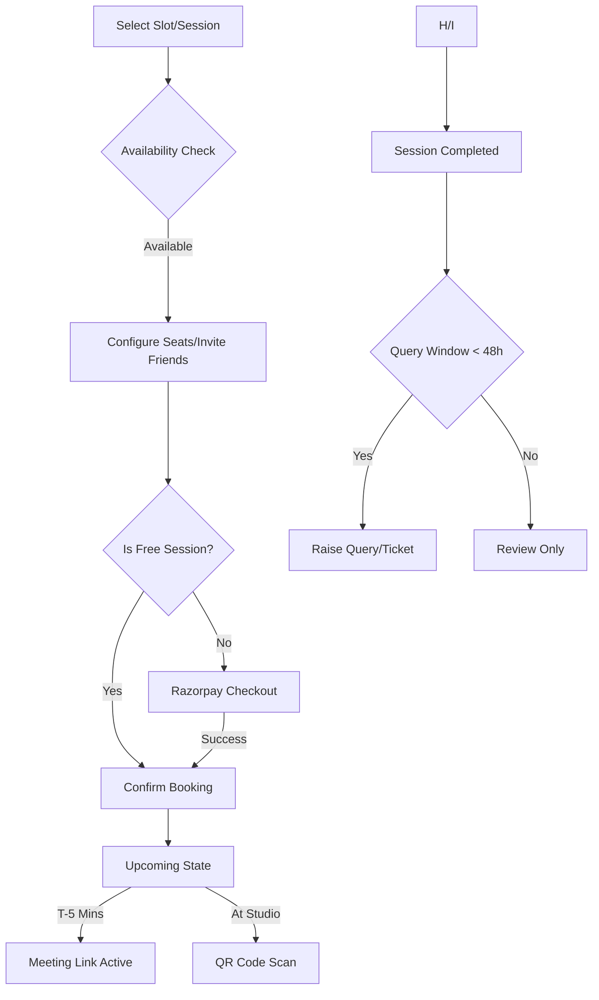

# Business Logic: Booking & Live Sessions

This document outlines the rules for booking studio time, inviting friends, and resolving issues post-session.

## 1. Offline Slot Booking Flow

1. **Selection:** User selects a 1-hour slot.
2. **Availability Check:** System validates if `capacity >= 1`.
3. **Invitation Logic:**
   - User can increase "Seat Count."
   - User enters friend's email addresses.
   - **Rule:** If a friend is not registered on **fitnearn.com**, they receive a "Join Fitnearn" invitation email. The session is only fully confirmed for them once they register.
4. **Checkout:** Payment processed via Razorpay.
5. **Confirmation:** User receives a QR Code for studio entry.

## 2. Live Session Rules

Live sessions follow a slightly different path:

- **Free Sessions:** If the session price is set to 0 by the owner, the payment step is skipped, and the session is booked immediately.
- **Meeting Access:** For online sessions, the **"Join"** button/link is programmatically hidden/disabled. It only becomes active **5 minutes before** the session starts.
- **Group Bookings:** Users can invite friends to Live Sessions using the same seat-increment logic as offline slots.

## 3. Attendance & Verification

- **Offline:** The user must present the QR code in the "Sessions" section. The Studio Owner scans this to verify the specific 1-hour slot.
- **Online:** Attendance is logged automatically when the user clicks the "Join" button.

## 4. Post-Session Query System (The 48-Hour Rule)

If a user faces issues (e.g., owner was absent, studio was dirty, meeting link failed):

- **Eligibility:** Queries can **only** be raised after the session status is `COMPLETED`.
- **Time Window:** The "Raise a Query" option is available for exactly **48 hours** post-completion.
- **Requirements:** User must provide a Reason and an optional Screenshot/Attachment.
- **Admin Alert:** Queries are funneled to the Admin Panel for resolution.

## 5. State Flow Diagram

