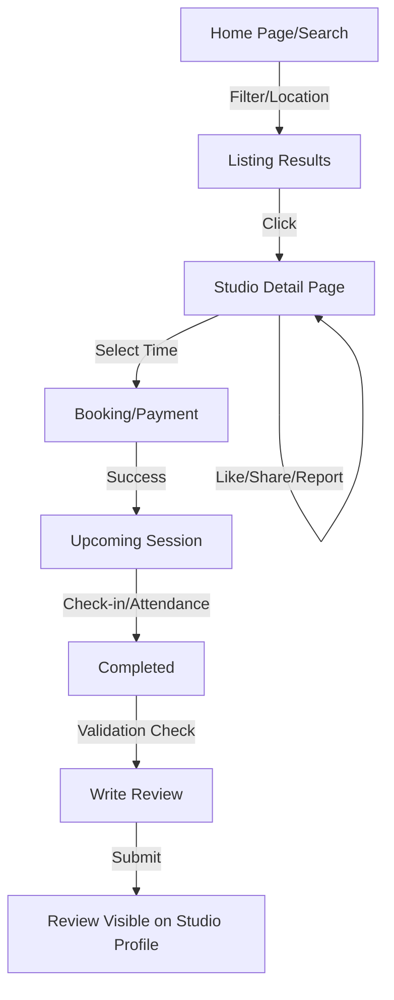

# Business Logic & State Flow

This document defines how users interact with studios and the rules governing social actions like liking and reviewing.

## 1. Studio Discovery Rules

- **Proximity:** Users must grant location permissions to see "Nearby" results. If denied, a default city-center location is used.
- **Personalization:** If a user has "Liked" a studio, that studio will appear at the top of their search results whenever they are within the search radius.
- **Filtering:** Users can combine multiple filters (e.g., Category: "Yoga" + Amenity: "AC"). Only studios matching **all** selected filters are shown.

## 2. Interaction Logic

### Social Actions

- **Like:** A toggle action. Increases the studio's internal "Popularity Score."
- **Share:** Generates a deep link to the Studio Detail page.
- **Report:** Users can flag a studio for "Incorrect Info" or "Misbehavior." This sends an immediate alert to the Admin Panel for investigation.

### Booking Access

From the Studio Detail page, users can initiate two types of transactions:

1. **Offline Slot Booking:** Selecting a specific 1-hour window.
2. **Live Session Booking:** Selecting a scheduled event (Online/Offline).

## 3. Review & Rating Business Rules

The review system is strictly "Transaction-Verified."

- **Eligibility:** A user can **only** post a review if:
  1. The booking status is `COMPLETED`.
  2. No previous review exists for that specific `booking_id`.
- **Post-Completion Window:** Once a session ends, the "Write a Review" button is activated in the user's booking history.
- **Persistence:** Once a review is submitted, it is final. Users cannot review the same booking twice, though they can review the studio again after a **different** future booking.

## 4. User State Flow

