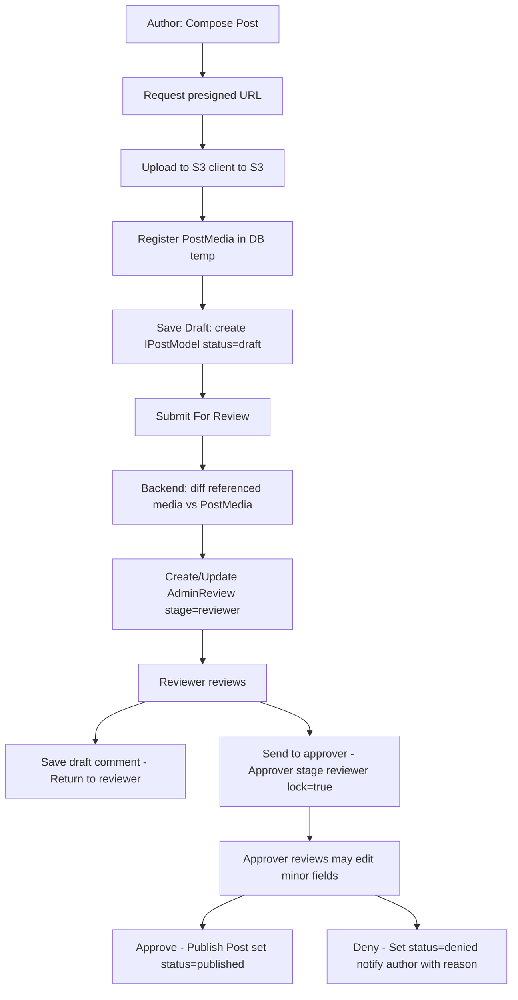

---

title: "Post Management — Architecture & Workflow"
description: "High-level overview, component architecture and workflow for Post Management (authoring, media uploads, 2-stage review, publish/deny, analytics)."
---

# Post Management — Overview & High-level Architecture

This document describes the **Post Management** feature: how coaches and admins create posts (message + optional image or video), how media is uploaded and managed, the two-step admin review (reviewer → approver), versioning and history, and how published posts are surfaced, moderated and analyzed. This is an architecture + workflow document — *not* an API reference.

---

## Purpose & Goals

* Allow coaches and admin users to create short posts (text + optional image/video).
* Support safe media uploads using **S3 presigned URLs** (client uploads directly).
* Provide a robust **two-stage review** process (Reviewer → Approver) with draft comments and *lock* semantics.
* Keep an audit trail (workflow history and admin comments) and support versioning for edits.
* Prevent stale/unused media (delete unused S3 objects when post content changes).
* Support analytics (likes, views, shares) and admin moderation (reports, delete).

---

## Actors

* **Author (Coach / Admin user)** — creates posts, may edit drafts, submits for review.
* **Reviewer Admin (Stage 1)** — validates content, writes reviewer comments, may save a draft comment or send to approver. Cannot edit post content.
* **Approver Admin (Stage 2)** — can review reviewer comments and also make *minor edits* if necessary; approves or denies the post. Can save draft comments while `lock === false`.
* **Website Users (Authenticated / Guest)** — view and interact with published posts. Guests can only view/share.
* **Background Workers** — handle tasks like orphan-media cleanup, video transcoding, thumbnail generation, and sending notifications.
* **Storage (S3)** — stores images/videos and generated thumbnails/previews.

---

## High-level Components

* **Frontend (Web / Coach App UI)**

  * Post composer with message box and media picker.
  * Requests presigned URLs from backend; uploads media directly to S3.
  * Post submit flow: Save draft → Submit for review → Show review/approval state.

* **Backend API**

  * Handles create/update/save-draft/submit operations.
  * Issues presigned upload URLs and registers uploaded media metadata.
  * Compares content image/video references to registered media for cleanup before sending to review/publish.
  * Manages `IPostModel` documents, `AdminReview` audit objects, and `PostImage`/`PostMedia` registries.
  * Sends notifications and runs business rules around publish/deny.

* **Database (MongoDB)**

  * Stores post documents (`IPostModel`), review records, comments, likes, and history entries.

* **AWS S3**

  * Hosts media objects (non-public keys). Backend issues presigned upload & download URLs.

* **Worker / Queue**

  * Handles media cleanup, transcoding (if video), PDF generation (if needed), analytics aggregation.

---

## Data Model (primary)

Below is the `IPostModel` interface used across the controllers and persisted in the DB (exact schema provided by the application):

```ts
export interface IPostModel extends Document {
  publisherId: string;
  createdAt: Date;
  createdBy: string;
  createdByName: string;
  message: string;
  status: string;
  state: string;
  stage: string;
  imageUrl: string;
  imageKey: string;
  videoUrl: string;
  videoKey: string;
  postId: string;
  userType: string;
  version: number;
  reviewerAdmin: string;
  approverAdmin: string;
  likeEngagementTarget: number;
  likeEngagementNotification: {
    target: number;
    status: boolean;
  },
  history: IWorkflowHistory[]; // Array of workflow history objects
}
```

**Notes on fields (how they're used):**

* `state` — lifecycle status (e.g., `draft`, `under_review`, `approved`, `published`, `denied`, `deleted`).
* `stage` — current review stage (`new`, `in review`, `pending approval`, `closed`, etc.).
* `status` — operational state (e.g., `active`, `Inactive`).
* `imageKey` / `videoKey` — S3 object keys (used to build presigned URLs); `imageUrl` / `videoUrl` are derived public URLs or cached presigned URLs.
* `version` — increments on significant content updates or when the approver finalizes an edited post (used for rollback).
* `history` — array of `{ actor, action, comment?, timestamp, meta? }` entries recording workflow events.

---

## Workflow: Authoring → Review → Publish

### 1. Compose & Save Draft

* Author opens composer, enters `message`, optionally requests a **presigned upload URL** for media (image or video).
* Client uploads media directly to S3 using the presigned URL.
* After upload, client sends metadata (S3 `key`, `publicUrl`, `mimeType`, `size`) to backend to register the `PostMedia` entry associated with a draft `postId`.
* Saving as draft persists `IPostModel` with `status: 'draft'` and links to registered media.

### 2. Submit For Review

* When the author submits, backend:

  * Loads `IPostModel` draft and its registered media entries.
  * **Parses content** to extract referenced media URLs/keys.
  * **Diffs** registered media vs referenced media; any registered keys not referenced are scheduled for deletion (or deleted immediately depending on policy).
  * Creates/updates `AdminReview` metadata: assigns reviewer (if required), sets `stage: 'reviewer'`, and creates an initial `history` entry.
  * Sets `status: 'under_review'` (or similar) and returns updated post.

### 3. Reviewer (Stage 1)

* Reviewer reads the content (no direct content edits).
* Reviewer can:

  * **Save** a comment (draft) — stored in `AdminReview` with `lock === false`.
  * **Request changes** — post returned to author with reviewer comments.
  * **Send to approver** — reviewer finalizes their review and `lock` is set to `true` for their part.
* Reviewer actions update `history` and optionally notify the author.

### 4. Approver (Stage 2)

* Approver has reviewer comments and the post content.
* Approver can:

  * **Save** a draft comment while `lock === false`.
  * **Edit minor fields** (only for small fixes — business-enforced).
  * **Approve** — sets `status: 'approved'` or `published`, increments `version` if edits occurred, creates `history` entry, and triggers publication side effects (notify subscribers, index for search).
  * **Deny/Reject** — sets `status: 'denied'`, stores reason, notifies author with denial comment and returns to author for edit.
* Final actions by approver set the approver lock to `true` preventing further changes to that review entry.

### 5. Post-Publish Lifecycle

* Published posts are visible to the public (guests can view and share; only authenticated users can like/comment/report).
* Edits after publication typically produce a new `version`; old versions are kept in `history`.
* When content changes produce removed media, backend uses the same diff process to remove unused S3 objects.

---

## Media Upload & Lifecycle

**Presigned Upload Flow**

1. Client requests a presigned URL for a media type (`image` or `video`) and purpose (`post_media`).
2. Backend generates a unique S3 key (e.g., `posts/<postId>/uploads/<uuid>`) and a PUT presigned URL (short expiry).
3. Client uploads directly to S3 using that URL.
4. Client notifies backend with media metadata (key, mime, size); backend saves `PostMedia` entry (temporary register).

**Why register media separately?**

* To avoid orphaned S3 objects and to enforce cleanup when media is not ultimately used.
* Registered entries let backend perform a diff before finalizing a post, ensuring stale uploads are removed.

**Cleanup policy**

* On submit: delete registered keys not referenced in final content.
* Periodic worker: find `PostMedia` older than X hours with `status: 'unclaimed'` and delete from S3 and DB.
* When deleting a post: remove associated S3 objects if no other post/version references them.

**Video considerations**

* Video uploads may trigger async transcoding (e.g., HLS or MP4 variants) and thumbnail generation.
* Worker updates `videoKey` / `videoUrl` fields after processing.

---

## Locking & Audit Rules

* **Reviewer/Approver lock** semantics:

  * Each `AdminReview` entry has a `lock` boolean. While `lock === false`, the reviewer/approver may save or edit their comment.
  * When a finalizing action occurs (e.g., `send_to_approver`, `approve`, `reject`), that reviewer/approver `lock` is set to `true` and that comment/action becomes immutable.
* **History & audit**:

  * Every state transition must append a `history` record: `{ actorId, actorType, action, comment?, timestamp, extra }`.
  * Maintain reviewer and approver entries separately within `AdminReview` so the UI can show both streams.

---

## Notifications & Side Effects

* On **submit** → notify assigned reviewer (email/FCM).
* On **reviewer save** → optional in-app notification to author (if saved as draft and author should be aware).
* On **send_to_approver** → notify approver.
* On **approve** → publish notifications (followers, subscribers) and invalidate relevant caches.
* On **deny** → notify author with reason/comment and set post back to `draft` or `needs_revision`.
* On **delete** → notify post owner & delete associated media if safe.

---

## Analytics & Engagement

* Track and aggregate: `views`, `likes`, `shares`, `comments`, `reports`.
* `likeEngagementTarget` & `likeEngagementNotification` fields in `IPostModel` can be used for automatic achievement/notification triggers (e.g., notify author when likes cross `target`).
* Analytics pipeline:

  * Increment counters in a lightweight, append-only way (e.g., Redis / counters) to avoid write contention.
  * Periodic worker flushes aggregated counters to the DB.

---

## Security & Access Controls

* **Authorization**

  * Only authors (publisherId) or admins may edit a draft.
  * Reviewer and approver flow actions are gated by admin permissions.
  * Public read access controlled by `status === 'published'`.
* **Media access**

  * S3 objects are private. Backend generates presigned download URLs for authenticated users when required.
* **Input sanitization**

  * All `message` text should be sanitized (XSS prevention).
  * Media mime types are validated on upload registration.
* **Rate limiting / Abuse**

  * Limit post creation frequency per user.
  * Moderation queue for reported posts or rapid posting.

---

## Operational Considerations

* **Workers & Queues**: Use background queues for:

  * Deleting orphan media
  * Video transcoding & thumbnail generation
  * Notification fan-out
  * Analytics aggregation
* **Idempotency**: Ensure key operations are idempotent (e.g., approve/publish flow) to handle retries.
* **Backups & Retention**:

  * Retain published versions for audit and rollback.
  * Consider policy for media retention when posts are deleted vs. archived.
* **Scaling**:

  * Use CDN for delivered media or presigned URLs with CloudFront.
  * Use indices on `postId`, `publisherId`, `status`, `createdAt` for efficient queries.

---

## Flow Diagram



---

## Example `history` schema (suggested)

```json
[
  {
    "actorId": "admin:0001",
    "actorType": "REVIEWER",
    "action": "SAVED_COMMENT",
    "comment": "Please fix heading capitalization",
    "timestamp": "2025-10-08T10:00:00Z",
    "meta": {}
  },
  {
    "actorId": "admin:0002",
    "actorType": "APPROVER",
    "action": "APPROVED",
    "comment": "Approved with minor spacing changes",
    "timestamp": "2025-10-09T08:23:00Z",
    "meta": { "version": 2 }
  }
]
```

---

## Summary & Best Practices

* Always register client-uploaded media immediately after upload; use a registry (`PostMedia`) to detect and clean orphan uploads.
* Perform content→media diff at submit-time to remove unused S3 objects and avoid storage bloat.
* Keep reviewer and approver comments separate and immutable after `lock` flips to `true`.
* Use background workers for heavy tasks (video processing, cleanup).
* Preserve past versions and a complete `history` for audit and rollback.
* Enforce role-based authorization checks strictly on every state transition.

---
