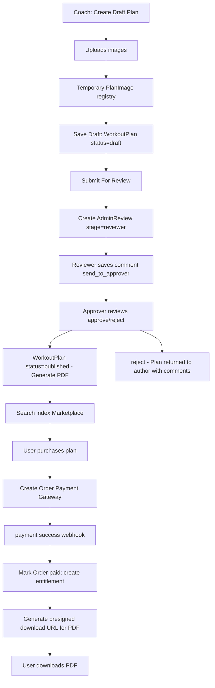

---

title: "Workout Plan Module — Architecture & Overview"
description: "High-level overview, component architecture and workflow for the Workout Plan module (creation, review, publish, purchase and delivery)."
---
# Workout Plan — Overview & High-level Architecture

This document describes the **Workout Plan** module: how plans are created by coaches (or admins), reviewed, published, discovered on the website, purchased by users, and delivered as downloadable PDFs. It focuses on architecture, responsibilities of each component, data flows and sequence of events — not API-level details.

---

## Goals

* Enable coaches and admins to **create, version and publish** multi-week workout plans containing days, exercises, sets, reps and media.
* Provide a smooth **purchase & delivery** flow where users can buy a plan and download a PDF (S3 presigned URL).
* Maintain **draft & review workflow** (draft → under_review → approved/published) with reviewer/approver audit trail and version history.
* Preserve media lifecycle (images / PDFs) to avoid stale S3 objects and to control access to paid assets via presigned URLs.
* Support analytics and reporting: purchases, downloads, views, and coach earnings.

---

## Actors

* **Coach** — creates and edits workout plans; submits plans for review; views sales/analytics for their plans.
* **Admin (Reviewer / Approver)** — performs two-stage review (reviewer then approver). Reviewer may save draft comments; approver can edit minor fields and finalize publish/reject decisions.
* **User (Buyer)** — purchases plans and downloads PDF deliveries. May be guest (browses only) or authenticated (can purchase).
* **Payment Gateway** — processes payments (e.g., Razorpay) and notifies backend on success/failure.
* **Storage (S3)** — stores plan media (images, thumbnails) and generated plan PDFs (encrypted/public depending on policy).
* **Backend Services** — handles business logic, DB, presigned URL creation, PDF generation and notification.

---

## Key Components

* **Frontend UI** (Website / Coach App)

  * Plan editor for rich content (days, exercises, media upload)
  * Plan marketplace for browsing and purchasing
  * Download flow with authenticated access to purchased assets

* **Backend APIs**

  * Plan management (create, save-draft, submit-for-review, versioning)
  * Payment & order management (create order, verify payment, mark as purchased)
  * Media lifecycle utilities
  * PDF generation service (server-side rendering of plan as downloadable PDF)

* **Database (MongoDB)**

  * Stores `WorkoutPlan` documents, `PlanVersion` history, `Orders` / `UserPurchases`, analytics counters, and `AdminReview` audit records.

* **AWS S3**

  * Stores uploaded images and generated PDFs. Backend issues presigned URLs for time-limited download URLs for purchased PDFs.

* **Other Utilities**

  * Notification (email / push) for purchase receipts, review requests, approvals
  * Background workers for PDF generation and S3 cleanup tasks

---

## Data lifecycle (high level)

1. **Authoring**

   * Coach composes a plan in the rich editor. Images are uploaded to S3 via cognito tokens; metadata saved into a temporary `PlanImage` collection (or array field) associated with the draft `planId`.
   * Saving as draft writes a `WorkoutPlan` document with `status: draft` and stores media keys.

2. **Submitting for review**

   * On submit, backend compares images referenced in final content with those in the `PlanImage` registry for the `planId`. Any S3 keys present in `PlanImage` but not used in content are removed (deleted from S3) and associated DB entries are cleaned up.
   * A `AdminReview` document is created/updated with `stage: reviewer` and reviewer/approver assignment metadata.

3. **Review / Approve**

   * Reviewer may save comments while `lock === false`. Finalizing `send_to_approver` sets `lock = true` and moves the workflow.
   * Approver can edit minor content (if allowed), then `approve` or `reject`. Approve transitions plan to `published` and sets `publishedAt`.

4. **Publishing & Discovery**

   * Published plans become discoverable in the marketplace. Indexing supports search by tag, category, coach, price, duration.

5. **Purchase & Delivery**

   * User initiates purchase: an `Order` record is created and payment flow handled via gateway.
   * On successful payment, `Order.status = paid`, an entitlement record is created linking `userId` ↔ `planId`, and a presigned download URL for the plan PDF is generated for the user (time-limited).
   * Backend updates coach earnings and analytics counters; admin notifications are sent.

---

## Security & Access Controls

* **Authorization**

  * Only plan owners (coach) and admins can edit or submit their own plans.
  * Review actions are gated by role-based checks (reviewer/approver permissions).
  * Downloads of paid PDFs require entitlement; presigned URL generation checks order ownership and `order.status === paid`.

* **Media Security**

  * All uploaded media stored in S3 with non-public keys. Downloads use presigned URLs with short expiry.

* **Payment Security**

  * Use payment gateway webhooks to verify payments server-side before granting access.

---

## Flow diagram

---

## Operational notes & implementation considerations

* **PDF generation**: Generate PDFs in a background worker to avoid long HTTP response times. Store generated PDFs in S3 using plan version key (e.g. `pdfs/planId/version.pdf`).
* **Image lifecycle**: Always maintain a registry of uploaded images for a plan; perform a diff before finalizing to delete unused images.
* **Versioning**: When editing a published plan, create a new `PlanVersion` object and keep the previous version for audit.
* **Scaling**: Offload PDF rendering and S3 cleanup to background queue (e.g., Bull / SQS). Use pagination and indexed queries for marketplace listing.
* **Analytics**: Maintain event counters (views, purchases, downloads) and store aggregated stats for dashboards.

---

## Suggested primary document fields (DB hints)

* `WorkoutPlan` (key fields): `planId`, `coachId`, `title`, `summary`, `weeks`, `days` (array of day-objects with exercises), `price`, `thumbnailKey`, `pdfKey`, `status` (`draft|under_review|published|rejected`), `version`, `createdAt`, `publishedAt`.
* `PlanVersion`: snapshot of `WorkoutPlan` state at publish time with `versionNumber`, `pdfKey`, and `createdAt`.
* `PlanImage`: `{ key, url, uploadedBy, uploadedAt, planId }` — temporary registry used during editing.
* `Order`: `{ orderId, userId, planId, amount, currency, paymentProvider, paymentStatus, createdAt }`.
* `AdminReview`: `{ planId, reviewerId, approverId, comments: [], lock, stage, timestamps }`.

---
