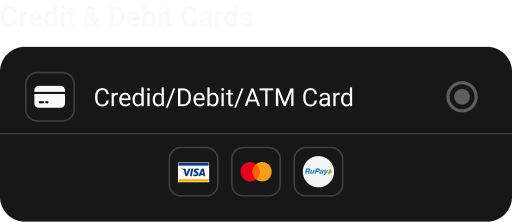

import { CodeBlock } from '@mintlify/components';

# CardPayment

The `CardPayment` widget is a specialized payment method selector for card-based payments, supporting various card types like Visa, MasterCard, and RuPay.



## Features

- Card payment selection
- Multiple card type support
- Visual card type indicators
- Material ripple effect
- Consistent styling
- Selection state management

## Usage

```dart
CardPayment(
  selected: PaymentType.Card,
  onChange: (type) {
    // Handle payment type change
  },
)
```

## Properties

| Property | Type | Description | Default |
|----------|------|-------------|---------|
| `selected` | `PaymentType` | Currently selected payment type | Required |
| `onChange` | `Function(PaymentType)` | Payment type change callback | Required |

## Implementation Details

The `CardPayment` widget is implemented as a `StatelessWidget` with the following structure:

```dart
import 'package:flutter_svg/flutter_svg.dart';
import 'package:flutter/material.dart';
import 'package:sizer/sizer.dart';
import '../../utils/types.dart';
import '../widget.dart';

class CardPayment extends StatelessWidget {
  PaymentType selected;
  Function(PaymentType) onChange;
  
  CardPayment({
    super.key, 
    required this.onChange, 
    required this.selected 
  });

  @override
  Widget build(BuildContext context) {
    return Container(
      decoration: BoxDecoration(
        color: Theme.of(context).cardColor,
        borderRadius: BorderRadius.circular(15.sp)
      ),
      child: Column(
        children: [
          // Card payment option
          Material(
            color: Colors.transparent,
            child: InkWell(
              borderRadius: BorderRadius.only(
                topLeft: Radius.circular(15.sp), 
                topRight: Radius.circular(15.sp)
              ),
              onTap: () => onChange(PaymentType.Card),
              child: Container(
                padding: EdgeInsets.only(
                  top: 13.sp, 
                  left: 13.sp, 
                  right: 13.sp, 
                  bottom: 6.5.sp
                ),
                child: Row(
                  children: [
                    Container(
                      decoration: BoxDecoration(
                        border: Border.all(
                          color: Theme.of(context).dividerColor, 
                          width: 1
                        ),
                        borderRadius: BorderRadius.circular(7.sp)
                      ),
                      height: 28.sp,
                      width: 28.sp,
                      padding: EdgeInsets.all(3.5.sp),
                      child: SvgPicture.asset(
                        "assets/payments/card.svg",
                        height: 20.sp, 
                        width: 20.sp
                      ),
                    ),
                    SizedBox(width: 10.sp),
                    Expanded(
                      child: Text(
                        "Credit/Debit/ATM Card",
                        style: Theme.of(context).textTheme.bodyMedium!.copyWith(
                          color: Color(0xffFAFAFA)
                        ),
                      ),
                    ),
                    CustomRadio(
                      selected: selected == PaymentType.Card,
                      onTab: () => onChange(PaymentType.Card),
                    )
                  ],
                )
              )
            )
          ),
          Divider(
            color: Theme.of(context).dividerColor, 
            height: 0
          ),
          // Card type indicators
          Container(
            padding: EdgeInsets.only(
              top: 6.5.sp, 
              left: 13.sp, 
              right: 13.sp, 
              bottom: 13.sp
            ),
            child: Row(
              crossAxisAlignment: CrossAxisAlignment.center,
              mainAxisAlignment: MainAxisAlignment.center,
              children: [
                _buildCardTypeIcon("assets/payments/visa.svg"),
                SizedBox(width: 6.5.sp),
                _buildCardTypeIcon("assets/payments/master_card.svg"),
                SizedBox(width: 6.5.sp),
                _buildCardTypeIcon("assets/payments/rupay.svg"),
              ],
            ),
          )
        ],
      ),
    );
  }
}
```

## Styling

The widget uses:
- Card-like container with rounded corners
- Consistent padding and spacing
- Theme-based colors
- Material ripple effect
- Custom border radius
- Standard icon sizes

## Best Practices

1. Use appropriate card type icons
2. Maintain consistent spacing
3. Handle selection state properly
4. Consider accessibility
5. Keep card type indicators visible
6. Use proper divider placement
7. Ensure proper touch targets 