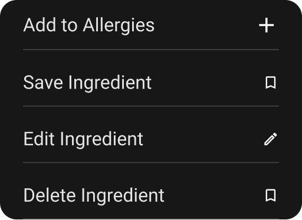

import { CodeBlock } from '@mintlify/components';

# IconMenuItem

The `IconMenuItem` widget is a versatile menu item component that combines text and an icon (either SVG or custom widget) with customizable styling and interaction capabilities.


## Features

- Flexible icon support (SVG or custom widget)
- Customizable padding and border radius
- Material ripple effect
- Consistent text styling
- Right-aligned icon
- Responsive sizing

## Usage

```dart
IconMenuItem(
  title: "Settings",
  asset: "assets/icons/settings.svg",
  onTab: () {
    // Handle menu item tap
  },
)
```

## Properties

| Property | Type | Description | Default |
|----------|------|-------------|---------|
| `title` | `String` | Menu item text | Required |
| `asset` | `String` | SVG asset path | Required |
| `borderRadius` | `BorderRadius?` | Custom border radius | `null` |
| `padding` | `EdgeInsetsGeometry?` | Custom padding | `EdgeInsets.only(top: 6.sp, bottom: 6.sp)` |
| `onTab` | `Function()` | Tap callback | Required |
| `widget` | `Widget?` | Custom widget to replace icon | `null` |

## Implementation Details

The `IconMenuItem` widget is implemented as a `StatelessWidget` with the following structure:

```dart
import 'package:flutter/material.dart';
import 'package:flutter_svg/flutter_svg.dart';
import 'package:sizer/sizer.dart';

class IconMenuItem extends StatelessWidget {
  final String title;
  final String asset;
  final BorderRadius? borderRadius;
  final EdgeInsetsGeometry? padding;
  final Function() onTab;
  final Widget? widget;
  
  const IconMenuItem({
    super.key, 
    required this.title,
    required this.asset, 
    this.borderRadius, 
    this.padding, 
    required this.onTab, 
    this.widget
  });

  @override
  Widget build(BuildContext context) {
    return Material(
      color: Colors.transparent,
      borderRadius: borderRadius,
      child: InkWell(
        onTap: onTab,
        borderRadius: borderRadius,
        child: Padding(
          padding: padding ?? EdgeInsets.only(
            top: 6.sp,
            bottom: 6.sp
          ),
          child: Row(
            children: [
              Text(
                title,
                style: Theme.of(context).textTheme.titleSmall!.copyWith(
                  color: Color(0xffE5E5E5),
                  fontSize: 18
                ),
              ),
              Spacer(),
              widget ?? SvgPicture.asset(
                asset,
                height: 12.sp, 
                width: 12.sp,
              )
            ],
          ),
        ),
      ),
    );
  }
}
```

## Styling

The widget uses:
- Transparent material background
- Customizable border radius
- Flexible padding
- Fixed text color (#E5E5E5)
- Fixed text size (18)
- Responsive icon sizing (12.sp)
- Material ripple effect
- Spacer for right-aligned icon

## Best Practices

1. Use appropriate icon sizes
2. Maintain consistent text styling
3. Consider accessibility
4. Use meaningful titles
5. Ensure proper touch targets
6. Keep menu items concise
7. Use appropriate padding for touch targets
8. Consider using custom widgets for complex icons
9. Maintain consistent spacing between items
10. Use appropriate border radius for visual hierarchy 