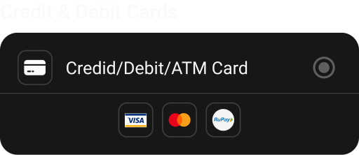

import { CodeBlock } from '@mintlify/components';

# OtherPayment

The `OtherPayment` widget is a specialized payment method selector for alternative payment methods, currently supporting Google Play Store and Wallet options.



## Features

- Alternative payment method selection
- Google Play Store integration
- Wallet payment support
- Material ripple effect
- Consistent styling
- Selection state management

## Usage

```dart
OtherPayment(
  selected: PaymentType.GooglePlay,
  onChange: (type) {
    // Handle payment type change
  },
)
```

## Properties

| Property | Type | Description | Default |
|----------|------|-------------|---------|
| `selected` | `PaymentType` | Currently selected payment type | Required |
| `onChange` | `Function(PaymentType)` | Payment type change callback | Required |

## Implementation Details

The `OtherPayment` widget is implemented as a `StatelessWidget` with the following structure:

```dart
import 'package:flutter/material.dart';
import 'package:sizer/sizer.dart';
import '../../utils/types.dart';
import '../widget.dart';

class OtherPayment extends StatelessWidget {
  PaymentType selected;
  Function(PaymentType) onChange;
  
  OtherPayment({
    super.key, 
    required this.onChange, 
    required this.selected 
  });

  @override
  Widget build(BuildContext context) {
    return Container(
      decoration: BoxDecoration(
        color: Theme.of(context).cardColor,
        borderRadius: BorderRadius.circular(15.sp)
      ),
      child: Column(
        children: [
          // Google Play Store option
          Material(
            color: Colors.transparent,
            child: InkWell(
              borderRadius: BorderRadius.only(
                topLeft: Radius.circular(15.sp), 
                topRight: Radius.circular(15.sp)
              ),
              onTap: () => onChange(PaymentType.GooglePlay),
              child: Container(
                padding: EdgeInsets.all(13.sp),
                child: PaymentTile(
                  asset: "assets/payments/playstore.svg",
                  title: "Google Play Store",
                  selected: selected == PaymentType.GooglePlay,
                  onTab: () => onChange(PaymentType.GooglePlay),
                ),
              ),
            ),
          ),
          Divider(
            color: Theme.of(context).dividerColor, 
            height: 0
          ),
          // Wallet option
          Material(
            color: Colors.transparent,
            child: InkWell(
              borderRadius: BorderRadius.only(
                bottomLeft: Radius.circular(15.sp), 
                bottomRight: Radius.circular(15.sp)
              ),
              onTap: () => onChange(PaymentType.Wallet),
              child: Container(
                padding: EdgeInsets.all(13.sp),
                child: PaymentTile(
                  title: "Wallet",
                  icon: Icon(
                    Icons.wallet, 
                    color: Theme.of(context).iconTheme.color
                  ),
                  selected: selected == PaymentType.Wallet,
                  onTab: () => onChange(PaymentType.Wallet),
                ),
              ),
            ),
          ),
        ],
      ),
    );
  }
}
```

## Styling

The widget uses:
- Card-like container with rounded corners
- Consistent padding and spacing
- Theme-based colors
- Material ripple effect
- Custom border radius
- Standard icon sizes

## Best Practices

1. Use appropriate payment method icons
2. Maintain consistent spacing
3. Handle selection state properly
4. Consider accessibility
5. Use proper divider placement
6. Ensure proper touch targets
7. Keep payment method names clear and concise 