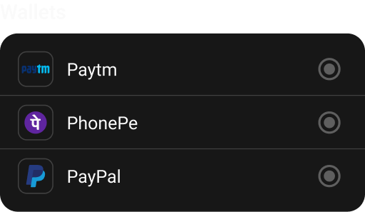

import { CodeBlock } from '@mintlify/components';

# WalletPayment

The `WalletPayment` widget is a specialized payment method selector for digital wallet payments, supporting popular wallet services like Paytm, PhonePe, and PayPal.



## Features

- Digital wallet payment selection
- Multiple wallet provider support
- Visual wallet app indicators
- Material ripple effect
- Consistent styling
- Selection state management

## Usage

```dart
WalletPayment(
  selected: PaymentType.PaytmWallet,
  onChange: (type) {
    // Handle payment type change
  },
)
```

## Properties

| Property | Type | Description | Default |
|----------|------|-------------|---------|
| `selected` | `PaymentType` | Currently selected payment type | Required |
| `onChange` | `Function(PaymentType)` | Payment type change callback | Required |

## Implementation Details

The `WalletPayment` widget is implemented as a `StatelessWidget` with the following structure:

```dart
import 'package:flutter/material.dart';
import 'package:sizer/sizer.dart';
import '../../utils/types.dart';
import '../widget.dart';

class WalletPayment extends StatelessWidget {
  PaymentType selected;
  Function(PaymentType) onChange;
  
  WalletPayment({
    super.key, 
    required this.onChange, 
    required this.selected 
  });

  @override
  Widget build(BuildContext context) {
    return Container(
      decoration: BoxDecoration(
        color: Theme.of(context).cardColor,
        borderRadius: BorderRadius.circular(15.sp)
      ),
      child: Column(
        children: [
          // Paytm option
          Material(
            color: Colors.transparent,
            child: InkWell(
              borderRadius: BorderRadius.only(
                topLeft: Radius.circular(15.sp), 
                topRight: Radius.circular(15.sp)
              ),
              onTap: () => onChange(PaymentType.PaytmWallet),
              child: Container(
                padding: EdgeInsets.only(
                  top: 13.sp, 
                  left: 13.sp, 
                  right: 13.sp, 
                  bottom: 6.5.sp
                ),
                child: PaymentTile(
                  asset: "assets/payments/paytm.svg",
                  title: "Paytm",
                  selected: selected == PaymentType.PaytmWallet,
                  onTab: () => onChange(PaymentType.PaytmWallet),
                ),
              ),
            ),
          ),
          Divider(
            color: Theme.of(context).dividerColor, 
            height: 0
          ),
          // PhonePe option
          Material(
            color: Colors.transparent,
            child: InkWell(
              onTap: () => onChange(PaymentType.PhonePeWallet),
              child: Container(
                padding: EdgeInsets.only(
                  top: 6.5.sp, 
                  left: 13.sp, 
                  right: 13.sp, 
                  bottom: 6.5.sp
                ),
                child: PaymentTile(
                  asset: "assets/payments/phonepe.svg",
                  title: "PhonePe",
                  selected: selected == PaymentType.PhonePeWallet,
                  onTab: () => onChange(PaymentType.PhonePeWallet),
                ),
              ),
            ),
          ),
          Divider(
            color: Theme.of(context).dividerColor, 
            height: 0
          ),
          // PayPal option
          Material(
            color: Colors.transparent,
            child: InkWell(
              borderRadius: BorderRadius.only(
                bottomLeft: Radius.circular(15.sp), 
                bottomRight: Radius.circular(15.sp)
              ),
              onTap: () => onChange(PaymentType.PaypalWallet),
              child: Container(
                padding: EdgeInsets.only(
                  top: 6.5.sp, 
                  left: 13.sp, 
                  right: 13.sp, 
                  bottom: 13.sp
                ),
                child: PaymentTile(
                  asset: "assets/payments/paypal.svg",
                  title: "PayPal",
                  selected: selected == PaymentType.PaypalWallet,
                  onTab: () => onChange(PaymentType.PaypalWallet),
                ),
              ),
            ),
          ),
        ],
      ),
    );
  }
}
```

## Styling

The widget uses:
- Card-like container with rounded corners
- Consistent padding and spacing
- Theme-based colors
- Material ripple effect
- Custom border radius
- Standard icon sizes

## Best Practices

1. Use appropriate wallet app icons
2. Maintain consistent spacing
3. Handle selection state properly
4. Consider accessibility
5. Use proper divider placement
6. Ensure proper touch targets
7. Keep wallet names clear and concise 