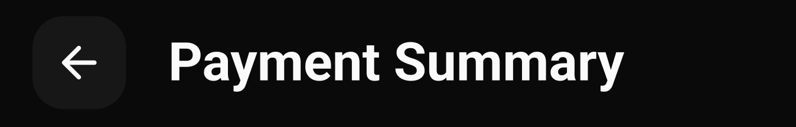

import { CodeBlock } from 'components/CodeBlock';
import { Callout } from 'components/Callout';

# CustomAppBar

The `CustomAppBar` is a versatile app bar component that provides a consistent navigation experience across the application. It implements `PreferredSizeWidget` and offers customizable leading actions, title, and trailing actions.


{/* <Frame>

</Frame> */}

## Features

- Transparent background with no elevation
- Customizable leading widget
- Centered title with ellipsis overflow
- Optional leading navigation
- Custom action buttons
- Responsive text sizing using sizer
- Automatic back navigation with context

## Implementation Details

### Basic Structure

The CustomAppBar is implemented as a StatelessWidget that implements PreferredSizeWidget:

```dart
class CustomAppBar extends StatelessWidget implements PreferredSizeWidget {
  final String title;
  final bool showLead;
  final Widget? leading;
  final List<Widget>? actions;

  const CustomAppBar({
    Key? key,
    required this.title,
    this.leading,
    this.showLead = true,
    this.actions,
  }) : super(key: key);

  @override
  Widget build(BuildContext context) {
    return AppBar(
      // Implementation details
    );
  }

  @override
  Size get preferredSize => Size.fromHeight(kToolbarHeight);
}
```

### Properties

| Property | Type | Description |
|----------|------|-------------|
| `title` | `String` | Required. The text to display in the app bar |
| `showLead` | `bool` | Optional. Whether to show the leading widget (default: true) |
| `leading` | `Widget?` | Optional. Custom leading widget to replace the default back button |
| `actions` | `List<Widget>?` | Optional. List of widgets to display in the app bar's action area |

### AppBar Implementation

The main AppBar implementation includes:

```dart
AppBar(
  backgroundColor: Colors.transparent,
  elevation: 0,
  title: Text(
    title,
    maxLines: 1,
    textAlign: TextAlign.center,
    overflow: TextOverflow.ellipsis,
    style: Theme.of(context).appBarTheme.titleTextStyle!.copyWith(
      fontSize: 17.sp,
    ),
  ),
  centerTitle: true,
  leading: showLead
      ? leading ?? Padding(
          padding: EdgeInsets.all(5),
          child: CustomIconButton(
            icon: Icons.arrow_back,
            onTab: () {
              if (context.canPop()) {
                context.pop();
              }
            },
          ),
        )
      : null,
  actions: actions,
)
```

## Usage Example

Here's how to use the CustomAppBar in your application:

```dart
class MyScreen extends StatelessWidget {
  @override
  Widget build(BuildContext context) {
    return Scaffold(
      appBar: CustomAppBar(
        title: 'My Screen',
        actions: [
          IconButton(
            icon: Icon(Icons.search),
            onPressed: () {
              // Handle search action
            },
          ),
          IconButton(
            icon: Icon(Icons.more_vert),
            onPressed: () {
              // Handle more options
            },
          ),
        ],
      ),
      body: Center(
        child: Text('Screen Content'),
      ),
    );
  }
}
```

### Custom Leading Example

```dart
CustomAppBar(
  title: 'Custom Screen',
  leading: IconButton(
    icon: Icon(Icons.menu),
    onPressed: () {
      // Handle menu action
    },
  ),
)
```

### Without Leading Example

```dart
CustomAppBar(
  title: 'No Back Button',
  showLead: false,
)
```

## Styling Guidelines

The app bar follows these styling conventions:

1. **AppBar Styling**
   - Background: Transparent
   - Elevation: 0
   - Center title alignment
   - Single line title with ellipsis overflow

2. **Title Styling**
   - Uses app bar theme's title text style
   - Font size: 17.sp
   - Centered alignment
   - Maximum 1 line with ellipsis overflow

3. **Leading Widget**
   - Default padding: 5 pixels all around
   - Uses CustomIconButton for back navigation
   - Optional custom leading widget

4. **Actions**
   - Right-aligned
   - Customizable list of widgets
   - No default spacing between actions

## Required Dependencies

Add these to your `pubspec.yaml`:

```yaml
dependencies:
  sizer: ^latest_version
  go_router: ^latest_version
```

## Best Practices

1. **Navigation**
   - Use `context.canPop()` to check if navigation is possible
   - Implement proper back navigation handling
   - Consider using named routes for better navigation management

2. **Performance**
   - Use const constructors where possible
   - Implement proper action callbacks
   - Consider caching custom leading widgets

3. **Accessibility**
   - Provide proper contrast ratios
   - Include semantic labels for actions
   - Support screen readers

## Related Components

- `CustomIconButton` - For back navigation
- `AppBar` - Base Material Design app bar
- `PreferredSizeWidget` - Interface for preferred size

## Notes

- The component is fully responsive using `sizer`
- Title text is automatically truncated with ellipsis
- Back navigation is handled automatically when using default leading
- Custom leading widget can be provided for different navigation patterns
- Actions are optional and can be customized as needed
- The app bar height is fixed to `kToolbarHeight`
