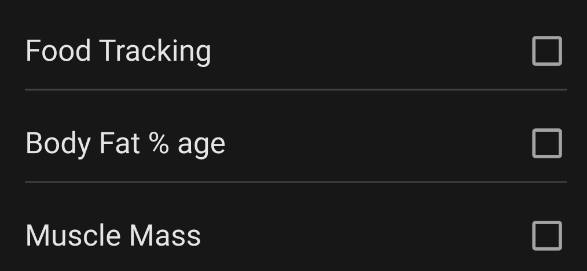

import { CodeBlock } from '@mintlify/components';

# CustomListTile

The `CustomListTile` widget is a versatile list item component that supports both checkbox and radio button selection styles. It's designed for list-based selection interfaces with customizable styling options.



## Features

- Checkbox or radio selection
- Customizable title style
- Optional tail widget
- Material ripple effect
- Custom padding support
- Color customization

## Usage

```dart
CustomListTile(
  title: 'Option 1',
  slelected: true,
  showCheckBox: true,
  onTab: () {
    // Handle selection
  },
  titleStyle: TextStyle(fontSize: 16),
  checkBoxColor: Colors.blue,
  padding: EdgeInsets.all(8),
)
```

## Properties

| Property | Type | Description | Default |
|----------|------|-------------|---------|
| `title` | `String` | Display text | Required |
| `slelected` | `bool` | Selection state | `false` |
| `showCheckBox` | `bool` | Use checkbox instead of radio | `false` |
| `onTab` | `Function()` | Selection callback | Required |
| `titleStyle` | `TextStyle?` | Custom text style | `null` |
| `color` | `Color?` | Custom color for radio | `null` |
| `checkBoxColor` | `Color?` | Checkbox border color | `null` |
| `tail` | `Widget?` | Custom tail widget | `null` |
| `padding` | `EdgeInsetsGeometry?` | Custom padding | `EdgeInsets.only(bottom: 10.sp, top: 10.sp)` |

## Implementation Details

The `CustomListTile` widget is implemented as a `StatelessWidget` with the following structure:

```dart
import 'package:flutter/material.dart';
import 'package:sizer/sizer.dart';

import '../widget.dart';

class CustomListTile extends StatelessWidget {
  final Function() onTab;
  TextStyle? titleStyle;
  String title;
  bool slelected;
  EdgeInsetsGeometry? padding;
  bool showCheckBox;
  Color? color;
  Color? checkBoxColor;
  Widget? tail;

  CustomListTile({
    super.key, 
    required this.onTab, 
    required this.title,
    this.slelected = false,
    this.padding,
    this.showCheckBox = false,
    this.color,
    this.checkBoxColor,
    this.tail,
    this.titleStyle,
  });

  @override
  Widget build(BuildContext context) {
    return Material(
      color: Colors.transparent,
      child: InkWell(
        onTap: onTab,
        child: Padding(
          padding: padding ?? EdgeInsets.only(bottom: 10.sp, top: 10.sp),
          child: Row(
            children: [
              Expanded(
                child: Text(
                  title,
                  style: titleStyle ?? Theme.of(context).textTheme.bodyMedium!.copyWith(
                    fontSize: 18
                  ),
                ),
              ),
              tail != null ? tail! :
                showCheckBox ?
                Checkbox(
                  value: slelected,
                  checkColor: Colors.white,
                  activeColor: Theme.of(context).primaryColor,
                  onChanged: (v) => onTab(),
                  side: checkBoxColor == null ? null : BorderSide(
                    color: checkBoxColor!,
                    width: 1.6
                  ),
                )
                : CustomRadio(selected: slelected, color: color)
            ],
          ),
        ),
      ),
    );
  }
}
```

## Styling

The widget uses:
- Material Design checkbox/radio components
- Customizable text styles
- Flexible padding options
- Material ripple effect
- Theme-based colors

## Best Practices

1. Use consistent selection styles (checkbox vs radio)
2. Provide clear and concise titles
3. Use appropriate padding for list context
4. Consider accessibility when choosing colors
5. Use tail widget for additional actions
6. Maintain consistent styling across list items 