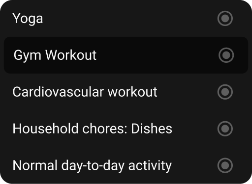

import { CodeBlock } from '@mintlify/components';

# DropdownTile

The `DropdownTile` widget is a simple and lightweight component designed for dropdown menus. It features a radio selection indicator and clean text display, making it ideal for selection lists in dropdown contexts.



## Features

- Radio selection indicator
- Simple text display
- Material ripple effect
- Customizable border radius
- Lightweight implementation

## Usage

```dart
DropdownTile(
  name: 'Option 1',
  selected: true,
  onTap: () {
    // Handle selection
  },
)
```

## Properties

| Property | Type | Description | Default |
|----------|------|-------------|---------|
| `name` | `String` | Display text | Required |
| `selected` | `bool` | Selection state | `false` |
| `onTap` | `Function()?` | Selection callback | `null` |

## Implementation Details

The `DropdownTile` widget is implemented as a `StatelessWidget` with the following structure:

```dart
import 'package:flutter/material.dart';
import 'package:sizer/sizer.dart';

import '../widget.dart';

class DropdownTile extends StatelessWidget {
  bool selected;
  String name;
  Function()? onTap;
  
  DropdownTile({
    super.key, 
    required this.name, 
    this.selected = false,
    this.onTap
  });

  @override
  Widget build(BuildContext context) {
    return Material(
      color: Colors.transparent,
      child: InkWell(
        borderRadius: BorderRadius.circular(10.sp),
        onTap: onTap,
        child: Padding(
          padding: const EdgeInsets.all(10.0),
          child: Row(
            children: [
              Expanded(child: Text(name)),
              CustomRadio(selected: selected)
            ],
          ),
        ),
      ),
    );
  }
}
```

## Styling

The widget uses:
- Material ripple effect
- Custom border radius
- Consistent padding
- Radio selection indicator
- Expanded text layout

## Best Practices

1. Use clear and concise names
2. Implement proper selection handling
3. Consider accessibility
4. Maintain consistent spacing
5. Use appropriate border radius
6. Keep dropdown items focused and minimal 