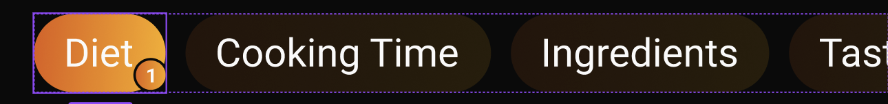

import { CodeBlock } from 'components/CodeBlock';
import { Callout } from 'components/Callout';

# CustomFilterChip

The `CustomFilterChip` is a versatile filter component that provides a selectable chip with optional badge support. It features gradient styling and can be used for filtering, categorization, or selection purposes in your application.



## Features

- Selectable state with visual feedback
- Optional badge display with count
- Gradient styling for selected and unselected states
- Customizable padding and text
- Responsive design using sizer
- Touch feedback with InkWell

## Implementation Details

### Basic Structure

The CustomFilterChip is implemented as a StatelessWidget with the following structure:

```dart
class CustomFilterChip extends StatelessWidget {
  final String title;
  final Function() onTap;
  final bool showBadge;
  final bool isSelected;
  final int badgeCount;

  const CustomFilterChip({
    super.key, 
    required this.title, 
    required this.onTap, 
    this.showBadge = false, 
    this.isSelected = false, 
    this.badgeCount = 0
  });

  @override
  Widget build(BuildContext context) {
    return Stack(
      children: [
        // Main chip container
        Container(
          // Implementation details
        ),
        // Badge (if selected and showBadge is true)
        if(isSelected && showBadge)
          Positioned(
            // Badge implementation
          )
      ],
    );
  }
}
```

### Properties

| Property | Type | Description |
|----------|------|-------------|
| `title` | `String` | Required. The text to display in the chip |
| `onTap` | `Function()` | Required. Callback when the chip is tapped |
| `showBadge` | `bool` | Optional. Whether to show the badge (default: false) |
| `isSelected` | `bool` | Optional. Whether the chip is selected (default: false) |
| `badgeCount` | `int` | Optional. The number to display in the badge (default: 0) |

### Main Chip Implementation

The main chip container is implemented with gradient styling:

```dart
Container(
  margin: EdgeInsets.all(1),
  decoration: BoxDecoration(
    borderRadius: BorderRadius.circular(50),
    gradient: isSelected 
      ? UiGradient.instance.defaultGradient
      : UiGradient.instance.defaultGradient.scale(0.2)
  ),
  child: Material(
    color: Colors.transparent,
    child: InkWell(
      borderRadius: BorderRadius.circular(50),
      onTap: onTap,
      child: Padding(
        padding: EdgeInsets.symmetric(
          horizontal: 12.sp, 
          vertical: 5.sp
        ),
        child: Text(title),
      ),
    ),
  ),
)
```

### Badge Implementation

The badge is implemented as a positioned widget:

```dart
if(isSelected && showBadge)
  Positioned(
    right: 0,
    bottom: 0,
    child: Container(
      decoration: BoxDecoration(
        gradient: UiGradient.instance.defaultGradient,
        borderRadius: BorderRadius.circular(50),
        border: Border.all(
          color: Colors.black, 
          width: 1
        )
      ),
      height: 15,
      child: AspectRatio(
        aspectRatio: 1,
        child: Center(
          child: Text(
            "$badgeCount",
            style: Theme.of(context).textTheme.labelLarge!.copyWith(
              fontSize: 8.5
            ),
          )
        )
      ),
    ),
  )
```

## Usage Example

Here's how to use the CustomFilterChip in your application:

```dart
class FilterScreen extends StatefulWidget {
  @override
  _FilterScreenState createState() => _FilterScreenState();
}

class _FilterScreenState extends State<FilterScreen> {
  bool _isSelected = false;
  int _badgeCount = 3;

  @override
  Widget build(BuildContext context) {
    return Scaffold(
      body: Padding(
        padding: EdgeInsets.all(16.0),
        child: Wrap(
          spacing: 8.0,
          children: [
            CustomFilterChip(
              title: 'All',
              onTap: () {
                setState(() {
                  _isSelected = !_isSelected;
                });
              },
              isSelected: _isSelected,
              showBadge: true,
              badgeCount: _badgeCount,
            ),
            CustomFilterChip(
              title: 'Popular',
              onTap: () {
                // Handle tap
              },
            ),
          ],
        ),
      ),
    );
  }
}
```

## Styling Guidelines

The filter chip follows these styling conventions:

1. **Container Styling**
   - Border radius: 50 (circular)
   - Margin: 1 pixel all around
   - Gradient background based on selection state
   - Transparent Material widget for ink effects

2. **Text Styling**
   - Uses default text style
   - Padding: 12.sp horizontal, 5.sp vertical
   - Centered alignment

3. **Badge Styling**
   - Fixed height: 15 pixels
   - Aspect ratio: 1:1 (circular)
   - Black border: 1 pixel width
   - Gradient background
   - Text size: 8.5
   - Uses labelLarge text theme

4. **Selection States**
   - Selected: Full gradient
   - Unselected: Scaled gradient (0.2 opacity)

## Required Dependencies

Add these to your `pubspec.yaml`:

```yaml
dependencies:
  sizer: ^latest_version
```

## Best Practices

1. **State Management**
   - Use StatefulWidget when selection state needs to be managed
   - Implement proper state updates in onTap callback
   - Consider using a state management solution for complex scenarios

2. **Performance**
   - Use const constructors where possible
   - Implement proper badge count updates
   - Consider caching gradient instances

3. **Accessibility**
   - Provide proper contrast ratios
   - Include semantic labels
   - Support screen readers

## Related Components

- `UiGradient` - For gradient styling
- `Material` - For ink effects
- `InkWell` - For touch feedback

## Notes

- The component is fully responsive using `sizer`
- Badge is only shown when both `isSelected` and `showBadge` are true
- Gradient scaling is used for unselected state
- Badge has a fixed size and aspect ratio
- Consider using this component in a Wrap widget for multiple chips
