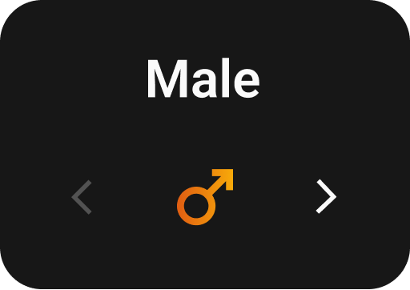

## Overview
The `GenderCard` widget is a custom Flutter widget that provides a gender selection interface with a smooth page transition between male and female options. It features a gradient-styled icon and navigation arrows for intuitive user interaction.



## Features
- Smooth page transitions between gender options
- Gradient-styled gender icons
- Navigation arrows for manual selection
- Localization support
- Responsive design using Sizer package
- Customizable appearance through theme

## Implementation Details

### Properties
| Property | Type | Description |
|----------|------|-------------|
| `gender` | `GenderType` | Current selected gender |
| `controller` | `PageController` | Controls the page view animation |
| `onChange` | `Function(GenderType)` | Callback when gender changes |
| `selectedIndex` | `int` | Current selected index (0 for male, 1 for female) |
| `moveNext` | `Function()` | Function to move to next gender |
| `moveBack` | `Function()` | Function to move to previous gender |

### Usage Example
```dart
GenderCard(
  gender: GenderType.Male,
  controller: PageController(),
  onChange: (newGender) {
    // Handle gender change
  },
  selectedIndex: 0,
  moveNext: () {
    // Handle next action
  },
  moveBack: () {
    // Handle back action
  },
)
```

### Styling
The widget uses:
- Custom gradient for icons using `UiGradient.instance.navBarItemGradient`
- Theme-based colors for background and text
- Responsive sizing using `sizer` package
- Rounded corners with `BorderRadius.circular(15.sp)`

### Localization
The widget supports localization through `AppLocalizations`:
- Male text: `AppLocalizations.of(context)!.male`
- Female text: `AppLocalizations.of(context)!.female`

## Implementation Notes
1. The widget uses a `PageView` for smooth transitions between gender options
2. Navigation arrows are disabled when reaching the end of the selection
3. Icons are styled using `ShaderMask` with a custom gradient
4. The widget is fully responsive and adapts to different screen sizes

## Best Practices
1. Always provide all required callbacks
2. Initialize the `PageController` before passing it to the widget
3. Handle the `onChange` callback to update your app's state
4. Ensure proper localization strings are available
5. Test the widget on different screen sizes
