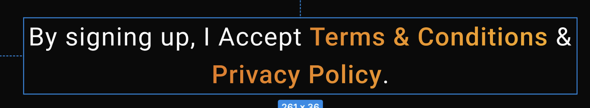

# GradientText Widget

The `GradientText` is a Flutter widget that renders text with a gradient color effect. It's a lightweight and efficient implementation that uses `ShaderMask` to apply gradient colors to text.



## Features

- Customizable gradient text
- Support for all standard Text widget properties
- Efficient rendering with RepaintBoundary
- Flexible text styling options
- Support for text overflow and max lines

## Properties

| Property | Type | Required | Description |
|----------|------|----------|-------------|
| `text` | String | Yes | The text content to display |
| `gradient` | Gradient | Yes | The gradient to apply to the text |
| `style` | TextStyle? | No | Custom text styling |
| `maxLines` | int? | No | Maximum number of lines for the text |
| `overflow` | TextOverflow? | No | How to handle text overflow |

## Usage Example

```dart
GradientText(
  'Hello World',
  gradient: LinearGradient(
    colors: [
      Colors.blue,
      Colors.purple,
    ],
  ),
  style: TextStyle(
    fontSize: 24,
    fontWeight: FontWeight.bold,
  ),
  maxLines: 2,
  overflow: TextOverflow.ellipsis,
)
```

## Implementation Details

The widget uses the following key components:

1. `RepaintBoundary`: Ensures efficient rendering by creating a separate layer
2. `ShaderMask`: Applies the gradient effect to the text
3. `BlendMode.srcIn`: Ensures the gradient only affects the text pixels

## Performance Considerations

- The widget uses `RepaintBoundary` to optimize rendering performance
- Gradient shaders are created only when the bounds change
- The widget is lightweight and doesn't add significant overhead

## Best Practices

1. Use appropriate gradient colors that provide good contrast
2. Consider text readability when choosing gradient colors
3. Use `maxLines` and `overflow` properties for better text control
4. Combine with appropriate text styles for optimal visual appearance
5. Test with different text lengths and screen sizes

## Common Use Cases

- Headers and titles
- Highlighted text sections
- Brand names and logos
- Decorative text elements
- Call-to-action buttons

## Example with Different Gradients

```dart
// Linear Gradient
GradientText(
  'Linear Gradient',
  gradient: LinearGradient(
    colors: [Colors.red, Colors.orange],
  ),
)

// Radial Gradient
GradientText(
  'Radial Gradient',
  gradient: RadialGradient(
    colors: [Colors.blue, Colors.green],
  ),
)

// Sweep Gradient
GradientText(
  'Sweep Gradient',
  gradient: SweepGradient(
    colors: [Colors.purple, Colors.pink],
  ),
)
```

## Styling Tips

1. Combine with bold fonts for better gradient visibility
2. Use larger font sizes for more noticeable gradient effects
3. Consider the background color when choosing gradient colors
4. Test gradient colors in both light and dark themes
5. Use appropriate text shadows for better readability
