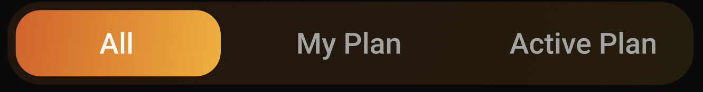

# GroupButton Widget

A customizable group button widget that allows users to select from multiple options in either horizontal or vertical layout.



## Overview

The `CustomGroupButton` is a versatile widget that creates a group of buttons where only one button can be selected at a time. It supports both horizontal and vertical layouts, custom gradients, and various styling options.

## Properties

| Property | Type | Description |
|----------|------|-------------|
| `titles` | `List<String>` | List of button titles (required) |
| `items` | `List<T>` | List of enum items (required) |
| `selectedItem` | `T` | Currently selected item (required) |
| `onChange` | `Function(T)` | Callback when selection changes (required) |
| `spacing` | `double?` | Spacing between buttons |
| `borderRadius` | `BorderRadius?` | Border radius of the container |
| `buttonBorderRadius` | `BorderRadius?` | Border radius of individual buttons |
| `selectedTextColor` | `Color?` | Text color for selected button |
| `unselectedTextColor` | `Color?` | Text color for unselected buttons |
| `padding` | `double?` | Padding around the entire group |
| `isVertical` | `bool?` | Whether to display buttons vertically |
| `selectedGradient` | `Gradient?` | Gradient for selected button |
| `unselectedGradient` | `Gradient?` | Gradient for unselected buttons |
| `border` | `BoxBorder?` | Border around the container |
| `elevation` | `double?` | Elevation of buttons |
| `buttonPadding` | `double?` | Padding inside each button |

## Usage Example

```dart
// Define your enum
enum Gender { male, female, other }

// In your widget
CustomGroupButton<Gender>(
  titles: ['Male', 'Female', 'Other'],
  items: Gender.values,
  selectedItem: selectedGender,
  onChange: (gender) {
    setState(() {
      selectedGender = gender;
    });
  },
  isVertical: false,
  spacing: 8.0,
  selectedGradient: LinearGradient(
    colors: [Colors.blue, Colors.lightBlue],
  ),
  unselectedTextColor: Colors.grey,
  selectedTextColor: Colors.white,
);
```

## Implementation Details

The widget consists of three main parts:

1. **Container**: The outer container that holds all buttons and applies the unselected gradient
2. **Layout Builder**: Either horizontal or vertical layout based on `isVertical` property
3. **Button Builder**: Creates individual buttons with proper styling and selection state

### Horizontal Layout

```dart
Row(
  children: List.generate(items.length, (index) {
    final isSelected = items[index] == selectedItem;
    return Expanded(
      child: Padding(
        padding: EdgeInsets.only(
          right: index < items.length - 1 ? (spacing ?? 0) : 0,
        ),
        child: _buildButton(context, index, isSelected),
      ),
    );
  }),
)
```

### Vertical Layout

```dart
Column(
  children: List.generate(items.length, (index) {
    final isSelected = items[index] == selectedItem;
    return Padding(
      padding: EdgeInsets.only(
        bottom: index < items.length - 1 ? (spacing ?? 0) : 0,
      ),
      child: _buildButton(context, index, isSelected),
    );
  }),
)
```

## Styling

The widget provides extensive styling options:

- **Gradients**: Custom gradients for both selected and unselected states
- **Colors**: Custom text colors for selected and unselected states
- **Border Radius**: Custom border radius for both container and individual buttons
- **Padding**: Custom padding for both container and individual buttons
- **Border**: Optional border around the container
- **Elevation**: Optional elevation for buttons

## Best Practices

1. Ensure `titles` and `items` have the same length
2. Use appropriate spacing based on your layout needs
3. Consider accessibility when choosing colors and contrasts
4. Use meaningful enum values for better code readability
5. Consider using `isVertical` for mobile layouts with many options

## Example with All Properties

```dart
CustomGroupButton<Gender>(
  titles: ['Male', 'Female', 'Other'],
  items: Gender.values,
  selectedItem: selectedGender,
  onChange: (gender) => setState(() => selectedGender = gender),
  spacing: 8.0,
  borderRadius: BorderRadius.circular(12),
  buttonBorderRadius: BorderRadius.circular(8),
  selectedTextColor: Colors.white,
  unselectedTextColor: Colors.grey,
  padding: 16.0,
  isVertical: false,
  selectedGradient: LinearGradient(
    colors: [Colors.blue, Colors.lightBlue],
  ),
  unselectedGradient: LinearGradient(
    colors: [Colors.grey.shade200, Colors.grey.shade300],
  ),
  border: Border.all(color: Colors.grey.shade300),
  elevation: 2.0,
  buttonPadding: 12.0,
);
```
