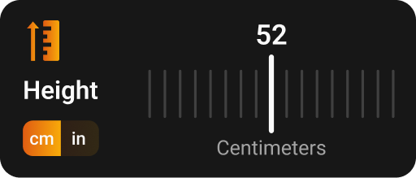

## Overview
The `HeightCard` widget is a custom Flutter component designed to provide an interactive height selection interface. It supports both centimeter and feet/inches measurements, with a visual scrollbar for height selection.



## Features
- Interactive height selection with a custom scrollbar
- Toggle between centimeter and feet/inches measurements
- Visual indicator for selected height
- Responsive design using sizer package
- Localization support
- Custom gradient styling

## Implementation

### Properties
```dart
class HeightCard extends StatefulWidget {
  int? selected;           // Currently selected height index
  HeightType type;         // Current measurement type (Centimeter or Feet)
  Function(int) onChange;  // Callback when height selection changes
  Function(HeightType) onTypeChange; // Callback when measurement type changes
}
```

### Usage Example
```dart
HeightCard(
  selected: 0,
  type: HeightType.Centimeter,
  onChange: (int newHeight) {
    // Handle height change
  },
  onTypeChange: (HeightType newType) {
    // Handle measurement type change
  },
)
```

## Widget Structure

### Main Components
1. **Measurement Type Toggle**
   - Two buttons for switching between cm and feet/inches
   - Gradient background for active/inactive states

2. **Height Display**
   - Shows current height in selected unit
   - Updates dynamically based on selection

3. **Custom Scrollbar**
   - Visual representation of height selection
   - Interactive scrolling interface
   - Custom styling for selected indicator

### Styling
- Uses custom gradients for active/inactive states
- Responsive sizing using sizer package
- Custom card design with rounded corners
- Dynamic text styling based on theme

## Implementation Details

### State Management
The widget maintains its state through:
- Selected height index
- Current measurement type
- Callback functions for state changes

### Measurement Conversion
The widget handles conversion between:
- Inches to centimeters
- Inches to feet/inches text format

### Custom Scrollbar
- Uses `CustomScrollBar` widget for height selection
- Visual indicators for selected height
- Smooth scrolling experience
- Custom item width and height

## Best Practices
1. Always provide both callback functions
2. Initialize with appropriate default values
3. Handle measurement type changes appropriately
4. Consider localization requirements
5. Test with different screen sizes

## Dependencies
- flutter_svg: For SVG image support
- sizer: For responsive sizing
- flutter_gen: For localization support

## Example Implementation
```dart
HeightCard(
  selected: 0,
  type: HeightType.Centimeter,
  onChange: (int newHeight) {
    setState(() {
      // Update height state
    });
  },
  onTypeChange: (HeightType newType) {
    setState(() {
      // Update measurement type
    });
  },
)
```

## Notes
- The widget is designed to be used in forms or settings screens
- Supports both light and dark themes
- Requires proper asset setup for SVG images
- Localization strings should be properly configured
