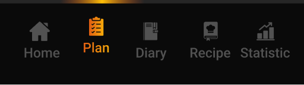

import navbar from '../widgets/images/navbar.png'
import { CodeBlock } from '@mintlify/components';

# CustomNavBar

The `CustomNavBar` is a custom bottom navigation bar widget that provides a modern and interactive navigation experience with gradient indicators and optional ad support.




## Features

- Gradient indicators for active navigation items
- Support for banner ads (conditionally shown based on subscription status)
- Customizable navigation items with icons and labels
- Responsive design using Sizer package
- Theme-aware styling

## Usage

```dart
CustomNavBar(
  currentIndex: 0,
  onTap: (index) {
    // Handle navigation
  },
  bannerAd: bannerAd, // Optional
)
```

## Properties

| Property | Type | Description |
|----------|------|-------------|
| `currentIndex` | `int` | The currently selected navigation item index |
| `onTap` | `Function(int)` | Callback function when a navigation item is tapped |
| `bannerAd` | `BannerAd?` | Optional banner ad to display above the navigation bar |

## Implementation Details

The navigation bar consists of two main parts:
1. A gradient indicator bar at the top showing the current selection
2. The navigation items with icons and labels

### Navigation Items

The navigation bar includes five default items:
- Home
- Plan
- Diary
- Recipes
- Statistics

Each item can be customized with:
- Custom SVG icons
- Text labels
- Gradient effects for selected state

## Example Implementation

```dart
import 'package:flutter/material.dart';
import 'package:google_mobile_ads/google_mobile_ads.dart';
import 'package:provider/provider.dart';
import 'package:sizer/sizer.dart';

class MyHomePage extends StatelessWidget {
  final BannerAd? bannerAd;
  
  @override
  Widget build(BuildContext context) {
    return Scaffold(
      body: YourContent(),
      bottomNavigationBar: CustomNavBar(
        currentIndex: 0,
        onTap: (index) {
          // Handle navigation
        },
        bannerAd: bannerAd,
      ),
    );
  }
}
```

## Styling

The navigation bar uses the following styling:
- Background color from theme: `Theme.of(context).bottomNavigationBarTheme.backgroundColor`
- Selected item gradient: Orange to Yellow gradient
- Unselected item color: `Color(0xff525252)`
- Text style: Uses theme's `bodyMedium` with custom color and size

## Dependencies

- `flutter_svg`: For rendering SVG icons
- `google_mobile_ads`: For banner ad support
- `provider`: For state management
- `sizer`: For responsive sizing

## Notes

- The banner ad is only shown when the user is not subscribed (controlled by `PaymentProvider`)
- The navigation bar height is fixed at 56.sp
- All icons are expected to be SVG files in the assets directory
- The widget uses `Selector` from Provider package for efficient rebuilds
