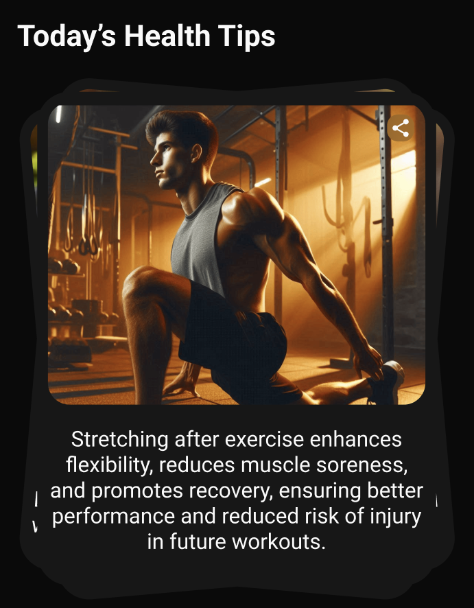

## Overview
The `TipsCard2` widget is a Flutter component that implements a swipeable card stack interface for displaying health and wellness tips. It features a visually appealing design with random rotations and offsets for each card, creating a dynamic and engaging user experience.



## Features
- Swipeable card interface
- Random card rotations and offsets
- Share functionality for each tip
- Offline mode support
- Responsive design for both mobile and tablet devices
- Beautiful UI with gradient backgrounds and rounded corners

## Implementation Details

### Widget Structure
The widget consists of three main components:
1. `TipsCard2` - The main container widget
2. `SwipeableCardStack` - Manages the stack of cards
3. `DraggableCard` - Handles individual card interactions

### Key Properties
- **Device Responsiveness**: Uses `Sizer` package for responsive layouts
- **Card Dimensions**: 
  - Height: 400px for mobile, 45% of screen height for tablets
  - Width: Full screen width with margins
- **Card Styling**:
  - Background color: `Color(0xff1F120A)`
  - Border radius: 15sp
  - Padding: 7sp horizontal and vertical

### Data Structure
Each tip is represented by a `TipsData` class with:
- `message`: The tip text
- `url`: Image asset path
- `rotation`: Random rotation value (-0.1 to 0.1 radians)
- `offsetX`: Random X offset (-8 to 8 pixels)
- `offsetY`: Random Y offset (-8 to 8 pixels)

### Usage Example
```dart
TipsCard2()
```

## Implementation in Flutter

### Dependencies
```yaml
dependencies:
  sizer: ^latest_version
  cached_network_image: ^latest_version
  provider: ^latest_version
```

### Code Structure
1. **Main Container**
```dart
Container(
  margin: EdgeInsets.only(
    left: SizerUtil.deviceType == DeviceType.tablet ? 15.sp : 20.sp,
    right: SizerUtil.deviceType == DeviceType.tablet ? 15.sp : 20.sp
  ),
  width: MediaQuery.of(context).size.width,
  child: SwipeableCardStack(),
)
```

2. **Card Stack Management**
```dart
class SwipeableCardStack extends StatefulWidget {
  @override
  _SwipeableCardStackState createState() => _SwipeableCardStackState();
}
```

3. **Card Interaction**
```dart
class DraggableCard extends StatefulWidget {
  final Widget child;
  final double rotation;
  final VoidCallback onDismissed;
  // ...
}
```

## Tips Data
The widget includes a predefined set of health and wellness tips:

1. Stretching after exercise
2. Quality sleep importance
3. Whole foods benefits
4. Healthy fats sources
5. Sugar reduction
6. Movement breaks
7. Green tea and hydration

## Best Practices
1. Use appropriate image assets with consistent dimensions
2. Keep tip messages concise and informative
3. Test on both mobile and tablet devices
4. Ensure proper offline mode handling
5. Optimize image loading with caching

## Performance Considerations
- Uses `RepaintBoundary` for efficient rendering
- Implements `Selector` for optimized rebuilds
- Caches network images
- Manages animations efficiently

## Accessibility
- Text is properly sized and colored for readability
- Touch targets are appropriately sized
- Offline mode provides clear feedback
- Share functionality is easily accessible
